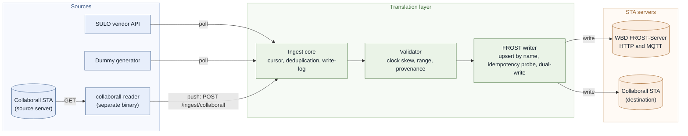

# Connecting sensors to an OGC SensorThings API server

**Geonovum Testbed 2026, topic 2: implementation report**

Clappform B.V. | Version 2.0 | 28 August 2026

Github Repo: [ClappFormOrg/Clappform-SensorThings](https://github.com/ClappFormOrg/Clappform-SensorThings)

## Document control

| Item               | Detail                                               |
| ------------------ | ---------------------------------------------------- |
| Report title       | Connecting sensors to an OGC SensorThings API server |
| Programme          | Geonovum Testbed 2026, topic 2                       |
| Implementing party | Clappform B.V.                                       |
| Version            | 2.0                                                  |
| Status             | Final                                                |
| Date               | 28 August 2026                                       |

*Table 1. Document control.*

**Servers in scope**

| Server                           | Endpoint                                    | Our role                               |
| -------------------------------- | ------------------------------------------- | -------------------------------------- |
| Waterschap Brabantse Delta (WBD) | `https://sta.wbd-rd.nl/FROST-Server/v1.1` | We write to it                         |
| Collaborall                      | `https://sta-server.collaborall.net/v1.1` | We read from it, and write back to it  |
| SULO, via the REEN platform      | `https://api.reen.com/api/3`              | We poll it; a vendor REST API, not STA |

*Table 2. Servers and sources we worked against.*

**A note on terminology.** SensorThings, shortened to STA throughout this report, is an open OGC
standard for publishing sensor data over plain HTTP. It defines a small fixed set of records, namely Thing, Location, Sensor, ObservedProperty, Datastream, Observation and FeatureOfInterest, plus one query language over them. Any client that speaks STA can therefore read any server that speaks STA, without the two parties agreeing anything in advance. We call those records entities, which is the term the standard uses.

## Executive summary

### What we were asked to do

Topic 2 asks participants to connect one or more sensors to an OGC SensorThings API server, to
validate that the connection is reliable, to document an approach others can reproduce, and to report
what we learned about the practical effort involved. Each participant picks their own technical
route: connect devices directly, or put an intermediary in between.

### What we built and validated

We built an intermediary translation layer instead of connecting devices directly, because our
sensors are not reachable as devices: the waste-container fleet reports into a vendor platform, and
what we get is a vendor API. The layer takes any source, maps it to the STA entity model, and writes
it to one or more STA servers, and the parts that make those writes reliable sit between the two
ends, meaning the stored cursor, the deduplication and the write-log.

We validated the layer against the live Brabantse Delta FROST-Server, not a local mock: five
containers with their fill-level datastreams and more than 1,400 observations, written and read back
over both HTTP and MQTT, including a multi-day catch-up and a restart.

We then did something that was not in the original scope, and learned more from it than from the
planned work. We used the same codebase to read another organisation's STA server and copy it into
ours. That gave us two directions, two independent servers and one entity model, and it turned a
single-server exercise into a real interoperability test.

Finally we connected the real thing. The SULO waste-container fleet reports into a proprietary vendor
platform, and once its documentation reached us we wrote a third adapter against it: 51 container slots
across 27 sites in Nieuwpoort, Belgium, four waste fractions, hourly fill-level estimates, published
into the same shared FROST server. This is the case most organisations are in: the source is
a vendor API that will never speak STA, and it is where the standard's value has to be argued. It also
produced the single most serious defect we found, in section 4.11.

### What we found

Our main finding is where the work goes.

> **Conforming to the standard was the cheap part. Everything around it, meaning transport,
> authentication, server-specific behaviour, concurrency, idempotency and semantics, is where the
> engineering went.**

Seven findings shaped our view most.

- **Mapping to STA was mechanical.** An unfamiliar domain, municipal waste containers, fitted the
  seven core entities with no extensions and no compromises. A second, unrelated domain
  then fitted the same mapping layer (see sections 1.2, 1.3 and 5.1).
- **Concurrency corrupted data in silence.** Resolving datastreams in parallel duplicated the
  entities they share. STA does not require names to be unique, so the server reported nothing at
  all (see section 4.4).
- **Idempotency is the client's problem, and it costs throughput.** Idempotency here means that
  writing the same reading twice leaves one copy on the server. Nothing in STA enforces
  it, so we built our own bookkeeping plus a check before every write, and that check, not the write,
  became the bottleneck (see section 4.5).
- **The same payload was accepted by one server and rejected by another.** We read the specification.
  The payload is legal, and the rejecting server enforces a constraint the standard does not state
  (see section 4.7).
- **Well-formed STA data can still be hard to use.** The second server is valid and carries
  four different definitions of "CO₂ level", plus units written as `"..."`. We achieved
  interoperability of form. We did not achieve interoperability of meaning (see section 4.8).
- **Server capabilities are not discoverable.** Which extensions exist, which authentication
  scheme applies, whether the build is standard, even which dialect of the query language is in
  force: we learned all of it by probing, one request at a time (see sections 4.2, 4.9 and 6.3).
- **Two individually correct rules combined to delete data.** Our newest source publishes forecasts in
  the same collection as measurements, distinguished only by a future timestamp. Rejecting a
  future-dated reading is right; advancing the poll cursor past a definitively rejected reading is also
  right. Together they moved the cursor into the forecast horizon and discarded every real measurement
  until that date, with no error logged, while the stream still looked healthy (see section 4.11).

Four clusters account for the effort the standard itself caused: semantic vocabulary, entity and
observation identity, capability discovery, and loosely typed fields. Section 6 covers all four, in
that order of importance.

Section 4.10 answers a question the findings raise again and again, because the answer decides
what to do about them. Is a given problem the FROST-Server implementation, the specific deployment, or the
standard? The three have different remedies on
different timescales, and confusing them is how integration teams end up absorbing other people's
bugs into their own client.

### Why we recommend the standard

The strongest argument for STA came out of the second integration. We pointed our reader at an
unfamiliar organisation's server: 46 observed properties, 460 datastreams, and a domain of pump
telemetry, seismics and air quality with no overlap at all with our own waste containers. Working
replication took days, with no bilateral agreement, no vendor SDK, no schema exchange, and no
conversation with the other party's engineers. Every vendor API integration we have done cost more
than that. Section 7 makes that case in full, together with the honest caveats.

## 1. What we built

Our starting position shaped the decisions that follow. The sensors in scope are fill-level sensors
on a municipal waste-collection fleet, and we cannot reach them, let alone reprogram them. They
report into a vendor platform, and what we get is a vendor API. There is no firmware to change and no
MQTT topic to redirect. Anything that connects those sensors to a SensorThings server has to sit
between the vendor API and the server and translate as it goes.

That situation is common, and it shapes
what connecting a sensor to STA means in practice. In most existing sensor estates the sensor is
already connected to something. The integration problem runs platform to
server, with someone else's data model on the near side and a standard one on the far side.

### 1.1 Shape of the system



*Figure 1. The translation layer, its sources and its targets. The Collaborall server appears twice,
because we read from it and also write back into it.*

The system has three seams: the adapter contract, the ingest core and the FROST writer.

**The adapter contract.** Every source produces the same canonical `Thing`, `Datastream` and
`Observation` types, whether that source is a polled vendor API, a pushed webhook or another STA
server. Canonical here means our own internal shape, one step removed from both the vendor and the
standard. Nothing downstream knows where the data came from. Adding the Collaborall source needed no
change to the ingest core, the validator or the writer, beyond loosening two type constraints (see
section 4.6).

**The ingest core.** It resolves the STA entity chain, meaning the six linked records STA requires
before an observation can exist: Thing, Location, Sensor, ObservedProperty, Datastream and
FeatureOfInterest. It then writes the observations, records what it wrote, and moves the per-stream
cursor forward. The cursor is a stored marker of the last reading we delivered successfully. Cursor
and write-log together are what make the pipeline safe to restart and able to fill gaps.

**The FROST writer.** It upserts entities by name, meaning it looks each entity up by name and
creates it only when it is absent. It checks for an existing observation before writing a new one,
and it supports two transports for creating observations: HTTP `POST`, or MQTT publish over
WebSockets, while entity upserts always go over HTTP. We can write several targets in parallel,
which is what we call dual-write.

### 1.2 How a waste container becomes STA entities

Table 3 is the whole mapping: one container arrives from the vendor API as an id, a position and a
fill percentage, and becomes six entities plus a reading.

| Domain concept         | STA entity                  | Name we generate                                  | Notes                                                                                                                        |
| ---------------------- | --------------------------- | ------------------------------------------------- | ---------------------------------------------------------------------------------------------------------------------------- |
| The container itself   | **Thing**             | `SULO Container 0001`                           | Vendor ids, source system and first-seen timestamp go in`properties`                                                       |
| Where it stands        | **Location**          | `Location of SULO Container 0001 at 2026-07-17` | GeoJSON Point. The date in the name keeps it stable per day, so a container that has not moved does not accumulate Locations |
| The fill sensor        | **Sensor**            | `SULO fill-level sensor <model> <firmware>`     | **Shared** on purpose by every container with the same model and firmware                                              |
| "Fill level"           | **ObservedProperty**  | `Fill level`                                    | **Shared by every container**                                                                                          |
| The pairing of the two | **Datastream**        | `Fill level — SULO Container 0001`             | Unit`Percent` / `%` (UCUM), `observationType: OM_Measurement`, `properties.expected_cadence_seconds`                 |
| What is being observed | **FeatureOfInterest** | `Container location: SULO Container 0001`       | Mirrors the container position                                                                                               |
| One reading            | **Observation**       | n/a                                               | `result`, `phenomenonTime`, `resultTime`, plus the two fields described below                                          |

*Table 3. Mapping one waste container onto the seven core STA entities.*

**The shared entities carry weight.** Sensor and ObservedProperty are shared across containers on
purpose, because there is one "Fill level" concept and not five hundred. That is correct modelling,
and it is what raced and duplicated when we resolved datastreams in parallel (see
section 4.4).

**We carry vendor detail in `properties`, not in fields of our own invention.** Each Thing gets
`vendor`, `vendor_native_id`, `clappform_source_system` and `first_seen_at`, plus whatever the
adapter adds. For the synthetic set that means `area` and `synthetic`. Nothing we carry forces a
non-standard field onto the wire, which keeps the output readable by any STA client (see section 5.2).

**Every entity name takes a configurable prefix.** On a server we share with other testbed parties,
`ENTITY_NAME_PREFIX`, for example `CF_`, goes in front of all seven names. Our upsert resolves
entities by name, so without a prefix it would bind to someone else's `Fill level` (see section 4.3).

Each stored Observation carries two more fields, and STA has a place for both, so we did not have to
invent one. `resultQuality.validated_by` and
`validation_version` record that our validation stage ran and which version ran. And
`parameters.raw_observation_id` holds the vendor's own identifier for that reading, which is the key
that makes re-polling safe.

### 1.3 Worked examples: what arrives, and what we send

Table 3 is the destination, and we reach it differently from each of our two kinds of source. A
vendor REST API has a model with nothing to do with STA, while another STA server already has the
right model, so the job there is faithful copying.

The shapes below follow the source schemas and our mapping code. The values illustrate rather
than reproduce captured traffic.

#### 1.3.1 Example A: a vendor REST API (SULO, on the REEN CMS platform)

**Step 1: what the vendor gives us.** Not one object, but four, from four endpoints. A slot:

```json
// GET /api/3/containerSlots
{ "id": 4821, "name": "Dorpsstraat 12 - rest", "customerKey": "SULO-NL",
  "contentType": 3, "site": "915", "container": 7734,
  "fillLevel": 24.0, "observedFillLevel": 27.0,
  "observedFillLevelTime": "2026-07-17T09:15:00Z", "lastModified": "2026-07-17T09:15:04Z" }
```

Its site, which is where the coordinates live:

```json
// GET /api/3/sites
{ "id": 915, "name": "Dorpsstraat", "areaName": "Centrum", "address": "Dorpsstraat 12",
  "postalCode": "8620", "city": "Nieuwpoort", "country": "BE",
  "latitude": 51.1298, "longitude": 2.7521 }
```

Its device, which describes the physical sensor, and the waste fraction:

```json
// GET /api/3/devices/linked
{ "id": 5567, "brand": "Sensoneo", "model": "Single Sensor 4", "serial": "SN-88213",
  "container": 7734, "installed": "2025-03-04T00:00:00Z",
  "status": { "signal": 74, "batteryPercentage": 91 } }

// GET /api/3/contentTypes
{ "id": 3, "name": "Restafval", "englishName": "Residual waste", "categoryName": "Household" }
```

And the readings themselves:

```json
// GET /api/3/fillLevels/containerSlot/4821?after=2026-07-17T08:00:00Z
{ "time": "2026-07-17T09:15:00Z", "fillLevel": "27", "containerSlot": 4821,
  "site": 915, "contentType": 3, "contentTypeName": "Restafval",
  "confidence": 100, "frozen": true }
```

**Step 2: what the adapter produces.** One canonical Thing with one Datastream, and one Observation:

```json
// canonical.Thing
{ "VendorID": "sulo", "VendorNativeID": "4821",
  "Description": "SULO waste container slot \"Dorpsstraat 12 - rest\" for Restafval
                  at site \"Dorpsstraat\" (Dorpsstraat 12, 8620, Nieuwpoort)",
  "Location": { "Lon": 2.7521, "Lat": 51.1298 },      // note the swap, see below
  "Properties": {
    "reen_container_slot_id": "4821", "reen_container_slot_name": "Dorpsstraat 12 - rest",
    "reen_customer_key": "SULO-NL", "reen_content_type_id": "3",
    "reen_content_type_name": "Restafval", "reen_site_id": "915",
    "reen_container_id": "7734", "reen_site_name": "Dorpsstraat",
    "reen_site_area": "Centrum", "address": "Dorpsstraat 12",
    "postal_code": "8620", "city": "Nieuwpoort", "country": "BE",
    "reen_device_id": "5567", "device_serial": "SN-88213" } }

// canonical.Datastream
{ "ThingVendorNativeID": "4821", "ObservedProperty": "FILL_LEVEL", "Unit": "PERCENT",
  "Description": "Fill level (% of capacity) of Restafval in SULO container slot
                  Dorpsstraat 12 - rest",
  "ExpectedCadenceSeconds": 3600,
  "SensorMetadata": { "source_system": "reen", "model": "Single Sensor 4",
    "firmware_version": "unknown", "brand": "Sensoneo", "serial": "SN-88213",
    "reen_device_id": "5567", "signal_percent": "74", "battery_percent": "91" } }

// canonical.Observation
{ "ThingVendorNativeID": "4821", "ObservedProperty": "FILL_LEVEL",
  "PhenomenonTime": "2026-07-17T09:15:00Z", "ResultTime": "2026-07-17T09:15:00Z",
  "Result": 27, "RawObservationID": "4821@2026-07-17T09:15:00Z" }
```

**Step 3: what we send to the STA server.** Six upserts and a write, shortened to the parts that show
the transformation:

```json
// POST /Things
{ "name": "CF_Sulo Container 4821",
  "description": "SULO waste container slot \"Dorpsstraat 12 - rest\" for Restafval ...",
  "properties": { "vendor": "sulo", "vendor_native_id": "4821",
    "clappform_source_system": "smartsulo", "first_seen_at": "2026-07-17T09:17:40Z",
    "reen_container_slot_id": "4821", "city": "Nieuwpoort", "...": "..." } }

// POST /Things(96)/Locations
{ "name": "CF_Location of Sulo Container 4821 at 2026-07-17",
  "encodingType": "application/geo+json",
  "location": { "type": "Point", "coordinates": [2.7521, 51.1298] } }

// POST /Sensors
{ "name": "CF_Sulo fill-level sensor Single Sensor 4 unknown",
  "encodingType": "application/json",
  "metadata": { "brand": "Sensoneo", "model": "Single Sensor 4",
                "serial": "SN-88213", "...": "..." } }

// POST /ObservedProperties
{ "name": "CF_Fill level", "description": "Container fill level as a percentage of total capacity",
  "definition": "http://qudt.org/vocab/quantitykind/DimensionlessRatio" }

// POST /Datastreams
{ "name": "CF_Fill level — Sulo Container 4821",
  "unitOfMeasurement": { "name": "Percent", "symbol": "%",
    "definition": "http://www.opengis.net/def/uom/UCUM/0/%" },
  "observationType": "http://www.opengis.net/def/observationType/OGC-OM/2.0/OM_Measurement",
  "Thing": { "@iot.id": 96 }, "Sensor": { "@iot.id": 41 }, "ObservedProperty": { "@iot.id": 12 },
  "properties": { "expected_cadence_seconds": 3600 } }

// POST /Observations
{ "phenomenonTime": "2026-07-17T09:15:00Z", "resultTime": "2026-07-17T09:15:00Z",
  "result": 27,
  "FeatureOfInterest": { "@iot.id": 88 },
  "parameters": { "raw_observation_id": "4821@2026-07-17T09:15:00Z" },
  "resultQuality": { "validated_by": "clappform-translation-layer", "validation_version": "v1" } }
```

**Six parts of that transformation took thought,** and they represent what any vendor-to-STA
adapter deals with.

1. **The Thing is the container slot, not the container.** REEN attaches fill-level history to a slot
   rather than to the physical bin, because bins get swapped out and the measurement series has to
   survive that. The slot is therefore the stable sensing platform and becomes our Thing, and the
   container id drops down into a property. Getting this the wrong way round would produce a new
   Thing every time a bin was replaced, and break every series.
2. **Coordinates swap.** REEN reports `latitude, longitude`. GeoJSON, and therefore STA, expects
   `[longitude, latitude]`. The swap happens inside the adapter, so nothing downstream has to know
   about it. This is the easiest thing to get wrong in the whole pipeline, and it fails in silence. The
   JSON and the GeoJSON both stay valid, and the container sits in the Indian Ocean.
3. **Numbers arrive as strings.** REEN documents `fillLevel` as a string, `"27"`, and `site` as a
   string where every other cross-reference is an integer. Both decoders accept either
   form, because a schema that says one thing and a payload that says another is normal.
4. **Forecasts have to go before the cursor sees them.** `/fillLevels` mixes settled estimates with
   forecasts, and forecasts carry future timestamps. Leave one in and the validator correctly rejects
   it as `in_future`, but that counts as a final rejection, so the cursor moves past it. Every real
   measurement between now and that forecast date would then be dropped as `before_cursor`. One vendor quirk costs weeks of
   data. The adapter discards anything newer than now.
5. **We honour the vendor's own quality flag.** REEN sets `confidence` to 100 for a normal reading,
   80 when the distance measurement sat too close to the sensor, 60 when there was no measurement at
   all, and 0 when REEN itself judged the reading erroneous. We drop 0, keep the rest, and count the
   drops by reason instead of discarding them without a record.
6. **We normalise order and duplicates.** REEN returns newest first and pages by offset over live
   data, which can repeat a row. We remove duplicates by timestamp and sort oldest first, because
   that is the order cursor arithmetic needs.

Note also what is not in the outbound payload. We lose nothing REEN-specific, and we carry none of it
in a field of our own invention. Every vendor identifier rides in `properties`, which keeps the
result readable by any STA client (see section 5.2).

#### 1.3.2 Example B: another STA server (Collaborall), faithful passthrough

Here the source model is already STA, so we keep the transformation small on purpose. The aim is a
faithful copy, including phenomena we know nothing about. Passthrough means we reproduce the source's
own naming instead of substituting our own.

**Step 1: what we read,** using `$expand` so related entities arrive inline:

```json
// GET /Things?$expand=Locations
{ "@iot.id": 31, "name": "Netatmo Indoor 24E124707E427318",
  "properties": { "deviceEUI": "24E124707E427318", "floor": 2 },
  "Locations": [ { "@iot.id": 44,
                   "location": { "type": "Point", "coordinates": [4.478, 51.925] } } ] }

// GET /Things(31)/Datastreams?$expand=Sensor,ObservedProperty
{ "@iot.id": 148, "name": "motion",
  "observationType": "http://www.opengis.net/def/observationType/OGC-OM/2.0/OM_TruthObservation",
  "unitOfMeasurement": { "name": "...", "symbol": null, "definition": "..." },
  "Sensor": { "@iot.id": 9, "name": "Netatmo module" },
  "ObservedProperty": { "@iot.id": 61, "name": "motion",
    "definition": "https://en.wikipedia.org/wiki/Motion_detection" } }

// GET /Datastreams(148)/Observations
//     ?$filter=phenomenonTime gt 2026-07-21T00:00:00Z&$orderby=phenomenonTime asc
{ "@iot.id": 90211, "phenomenonTime": "2026-07-22T07:31:00Z", "result": true }
```

**Step 2: the canonical envelope** the reader posts to our own `/ingest/collaborall`. The
`Passthrough*` fields carry the source's own naming, so the mapper can reproduce it:

```json
{ "things": [ { "thing": {
      "VendorID": "collaborall", "VendorNativeID": "31",
      "Location": { "Lon": 4.478, "Lat": 51.925 },
      // note: 2 becomes "2", JSON-encoded
      "Properties": { "deviceEUI": "24E124707E427318", "floor": "2" } },
    "datastreams": [ {
      // ObservedProperty here is a stream key, not a fixed list member
      "ThingVendorNativeID": "31", "ObservedProperty": "motion",
      "Name": "motion", "ObservedPropertyName": "motion",
      "ObservedPropertyDefinition": "https://en.wikipedia.org/wiki/Motion_detection",
      "SensorName": "Netatmo module",
      "ObservationType": ".../OM_TruthObservation",
      "UnitName": "", "UnitSymbol": "", "UnitDefinition": "" } ] } ],      // "..." blanked
  "observations": [ {
      "ThingVendorNativeID": "31", "ObservedProperty": "motion",
      "PhenomenonTime": "2026-07-22T07:31:00Z",
      "ResultRaw": true } ] }                                              // verbatim, not a float
```

**Step 3: what we write to the destination,** the source's own names with our prefix:

```json
// POST /Things             -> { "name": "CF_Netatmo Indoor 24E124707E427318", ... }
// POST /Sensors            -> { "name": "CF_Netatmo module", ... }
// POST /ObservedProperties -> { "name": "CF_motion",
//                               "definition": "https://en.wikipedia.org/wiki/Motion_detection" }
// POST /Datastreams        -> { "name": "CF_motion",
//                               "observationType": ".../OM_TruthObservation",
//                        "unitOfMeasurement": { "name": "", "symbol": "",
//                                               "definition": "" } }
// POST /Observations
{ "phenomenonTime": "2026-07-22T07:31:00Z", "resultTime": "2026-07-22T07:31:00Z",
  "result": true,
  "parameters": { "raw_observation_id": "collaborall:148@2026-07-22T07:31:00Z" },
  "resultQuality": { "validated_by": "clappform-translation-layer", "validation_version": "v1" } }
```

**What this example shows that the first one does not.**

1. **`result` is not a number.** `true` travels from source to destination untouched, as `ResultRaw`,
   and the validator skips its numeric range checks, because a boolean has no range. Our own model typed
   `result` as `float64`, while the standard left it open (see section 4.6).
2. **We keep the source's vocabulary, however imperfect.** The ObservedProperty is `motion` and its
   definition points at Wikipedia. We do not improve it, because a copy that reclassifies its
   source is worse than one that copies faithfully. This is the material sections 4.8
   and 6.1 are about: the copy is honest, and still not useful in meaning.
3. **We blank placeholder units instead of passing them on.** The source's `"..."` unit name and
   definition become empty strings at the adapter boundary. Copying `"..."` onward would spread a
   placeholder into a second server as though it were data.
4. **We JSON-encode non-string properties.** Canonical `Properties` is `map[string]string`, so
   `"floor": 2` becomes `"floor": "2"`. Nothing is lost. This is a rough edge in our own canonical
   model rather than anything the standard imposes.
5. **We never reuse ids across servers.** The source's `@iot.id 148` appears only inside the
   idempotency key. The destination assigns its own ids, and we correlate the two by name alone. That
   is the advice `hylkevds` gives in
   [discussion #11](https://github.com/Geonovum/testbed-sensordata-2026/discussions/11), where another
   participant asked how to handle dual-target delivery, and it is the reason section 6.2 matters so
   much to us.

### 1.4 What one cycle does

The mapping above is static, whereas the sequence below runs on every poll, and it is where the
reliability in section 2 comes from.

1. **Poll from a stored cursor.** The adapter asks the vendor for everything newer than the last
   observation we wrote successfully for each stream. The cursor lives in Postgres, so a restart
   resumes instead of starting over, and a multi-day outage becomes a catch-up rather than a hole.
2. **Normalise to canonical types.** The adapter emits Things, Datastreams and Observations in our own
   vocabulary. Everything downstream is vendor-agnostic from here on.
3. **Validate.** Drop readings with a missing or non-numeric result, drop fill levels outside 0-100,
   and reject timestamps implausibly far ahead of our clock. Stamp provenance on what survives. We
   count rejections by reason instead of discarding them without a record.
4. **Resolve the entity chain.** For each Thing and Datastream pair: upsert the Thing, then the
   Location under that Thing, then Sensor, ObservedProperty, Datastream and FeatureOfInterest. Each
   upsert is a cache lookup, then a `GET ?$filter=name eq ...`, then a `POST` only when the entity is
   absent.
5. **Write each observation.** Check our own write-log for this datastream and timestamp, ask the
   server for the same key, then either `POST` the observation or publish it over MQTT.
6. **Record and advance.** Write the log row, move the cursor. Only now do we treat the observation as
   delivered.
7. **Repeat per target.** With more than one target configured, steps 4 to 6 run per server, each
   with its own entity-id mapping. Server-assigned ids differ per server, so the only thing the two
   may share is the names.

Steps 4 and 5 are the expensive ones, and they are expensive for the same reason. A client cannot tell the server
"create this if it does not already exist", so both steps read before they write.
That is one extra round-trip per entity and one per observation, and section 6.2 is the argument for
removing them.

### 1.5 The three integrations

|                | **WBD (Brabantse Delta)**                                                 | **Collaborall**                                               | **SULO / REEN**                                                       |
| -------------- | ------------------------------------------------------------------------------- | ------------------------------------------------------------------- | --------------------------------------------------------------------------- |
| Direction      | We**write**                                                               | We**read**, then write back into our destination              | We**poll**, then write into WBD                                       |
| Domain         | Waste-container fill level                                                      | Pump pressure and flow, air quality, CO₂, seismics, weather        | Waste-container fill level (the real fleet)                                 |
| Scale          | 5 Things, 5 datastreams, 1,400+ observations                                    | 46 ObservedProperties, 460 datastreams                              | 51 container slots across 27 sites, hourly estimates                        |
| Transport      | HTTP POST**and** MQTT (`wss`), both validated                           | HTTP                                                                | HTTP                                                                        |
| Authentication | HTTP Basic (`write` account)                                                  | HTTP Basic                                                          | **Session token**, username/password traded for an `X-Token` header |
| Server         | **Customised** FROST build, with a project-scoped authorisation extension | An**independent, non-FROST** STA implementation (PHP/Laravel) | **Not an STA server at all**, a proprietary vendor REST API (REEN v3) |
| Purpose        | Prove the write path end to end against a live shared server                    | Prove STA as a source, and portability between servers              | Prove the adapter contract against a real vendor platform                   |

*Table 4. The three integrations side by side.*

The server row is the most important one in that table, and we had it wrong at first. We assumed
both targets were FROST-Server builds, and only one of them is: the Collaborall server is a
separate, independently written STA implementation. Its maintainer confirmed this in the testbed
discussions as the first non-FROST implementation in the programme, and the PHP/Laravel stack traces
other participants received from it point the same way. Once we knew that, the work became an
interoperability test rather than a single-server exercise. Every difference between the two targets
in section 4 is a difference between two independent readings of one specification, not two
configurations of one codebase. It is also the reason section 4.10 exists.

The third integration answers a different question from the first two. WBD and Collaborall are both STA
servers, so both tested the standard against itself. SULO's platform is not an STA server and never
will be: it is a proprietary vendor API, which is the situation most organisations are in when
they consider adopting the standard. It therefore tested the claim in section 1.6 that a vendor's
concerns can be kept behind one contract. It is also the only one of the three where the sensors are a
real operational fleet rather than a test fixture. The fill levels are live municipal waste containers
in Nieuwpoort, Belgium, across four waste fractions, reporting hourly. What that integration cost is in
section 3; what it taught is in sections 4.1, 4.9 and 4.11.

### 1.6 The build decisions that mattered

**We built a translation layer instead of connecting sensors to STA directly.** Our sources are
vendor APIs and ERP systems, not devices we can reprogram. A layer in between keeps vendor concerns
behind one contract, meaning authentication, pagination, rate limits and wire formats, and it lets the
same validated write path serve any future source.

**We hand-rolled an STA client on `net/http` instead of taking a third-party STA library.** This
looked like the more expensive option and turned out to be the cheaper one. STA's wire format is plain
JSON with OData-style query parameters, so the client is a few hundred lines. In return we kept the
upsert and idempotency behaviour explicit and easy to inspect, and that is where the subtle problems
in section 4 showed up. A library would have hidden them rather than prevented them. That is
a finding about the standard in itself: it is small enough to implement directly.

**We built a synthetic dummy adapter first.** Deterministic, labelled fake containers, with
`properties.synthetic = "true"` and names prefixed `Dummy `, let us exercise the whole chain against
the live WBD server before any real sensor connector existed. No vendor dependency, no risk of
polluting real records, and a one-command run that reviewers can reproduce. It paid for itself several
times over, because we discovered every finding in sections 4.1 to 4.5 with synthetic data.

**We made the reader a separate binary that pushes through our own ingest endpoint.** The Collaborall
reader, `cmd/collaborall-reader`, does not write to FROST directly. It reads the source and posts
canonical envelopes to `/ingest/collaborall`, so copied data passes through the same validation,
mapping and dual-write path as everything else. That gives us one code path to trust, and the reader
still deploys on its own. It keeps its own cursor file, and a re-run is safe because the service's
write-log removes duplicates.

## 2. Reliability we demonstrated

We validated all of this against live servers, not local mocks.

- **End-to-end persistence.** We created the full Thing, Datastream and Observation chain and read it
  back through the public API.
- **No duplicates.** Observations formed an unbroken 5-minute series, and the stored count matched
  the number of distinct cadence ticks: 16, then 455, then 1016, then 1423 across the run. MQTT
  publish offers no server-side uniqueness guarantee, so this held on our own bookkeeping alone.
- **Restart-safe gap recovery.** A gap of several days between runs filled from the stored cursor,
  with no duplicates.
- **Transport resilience.** The MQTT and WebSocket session dropped once and reconnected within about
  300 ms. We retried the publishes that fell in the gap.
- **Concurrency safety.** After the fix in section 4.4, a race-detector regression test asserts that
  many concurrent resolutions of one shared entity name produce exactly one POST.
- **Two transports, one mapping.** We confirmed observation writes over both HTTP POST and MQTT
  publish, with no change to the entity mapping.
- **A real vendor fleet, mapped without touching the write path.** The SULO adapter discovered 51
  container slots across 27 sites and 50 linked devices from the REEN API, and produced valid STA
  entities through the same validation, mapping and dual-write path as the synthetic and Collaborall
  data. No change was needed downstream of the adapter.
- **Self-healing under intermittent transport failure, observed to completion.** The client-side
  TLS-intercepting proxy of section 4.1 drops a fraction of connections, so the first SULO run
  registered only 10 of the 51 slots and failed the rest mid-chain. Because entity resolution is
  name-keyed and observation writes are checked against the write log, later cycles completed the
  missing slots instead of duplicating the finished ones: 10 slots and 12 observations at first read,
  then 17 and 21, then **48 slots and 152 observations after four hours**, unattended, with no
  duplicates and no manual replay. Because upsert is idempotent, a failing network cost us
  latency instead of data. This is the same property that made the multi-day
  catch-up above safe, observed here against a transport that was failing rather than absent. The
  three slots still absent are not transport casualties; section 4.12 explains them.

## 3. Where the effort went

This assessment is relative and qualitative, and it answers the testbed's question about the practical
effort of exposing sensor data through a common standard.

| Area                              | Effort                   | Why                                                                                                                         |
| --------------------------------- | ------------------------ | --------------------------------------------------------------------------------------------------------------------------- |
| STA entity mapping and write path | **Low**            | The entity model is well specified and complete. Mapping and name-keyed upsert were mechanical.                             |
| Concurrency and idempotency       | **Medium to high** | The shared-entity upsert race, and observation idempotency under real latency, needed real fixes.                           |
| Authentication                    | **Medium**         | Reads are authenticated too, and an empty password returns 500 instead of 401.                                              |
| Server-specific behaviour         | **Medium**         | The customised WBD profile, and a server rejecting a`Sensor.metadata` payload the specification allows (see section 4.7). |
| Semantic reconciliation           | **Medium**         | Duplicate ObservedProperty names, placeholder units, four vocabularies for one concept. Not fixable in code.                |
| Network and transport             | **Medium**         | Timeouts, MQTT reconnects and slow paths during catch-up all needed handling.                                               |
| Reading an unfamiliar STA server  | **Low to medium**  | 460 datastreams, unknown domain, no documentation, no contact, and still only days. See section 7.                          |
| Onboarding a third vendor API     | **Low**            | A documented REST API behind the existing adapter contract. Nothing downstream of the adapter changed. See section 3.1.     |
| Vendor data semantics             | **Medium to high** | Forecasts mixed into historical readings, and a confidence flag marking some readings unusable. See section 4.11.           |
| Reproducibility and tooling       | **Low to medium**  | Dummy adapter plus a one-command`docker compose`.                                                                         |

*Table 5. Relative implementation effort by area.*

Conforming to the standard was cheap, and production robustness against a real network, a real
authentication scheme and a real non-standard server is where the engineering lived. That second
cost exists whether or not you use a standard, which is why adopting one is close to free, and
section 7.3 works that argument through.

### 3.1 The third adapter, as a measured data point

The design set a reproducibility target: a contributor should be able to wire a second, non-SULO vendor
adapter and produce valid observations in at most one working day. The SULO/REEN adapter is the honest
test of it, because it is the first adapter written against the contract after the contract had
stabilised.

The mapping work landed inside that budget and the shared write path needed no changes at all. Two
things cost more than the mapping, and neither was the standard's doing:

- **Reading the vendor's documentation.** The published guide renders as a JavaScript single-page
  application with no content in the served HTML, so the machine-readable OpenAPI description behind it
  had to be found and read directly. Once located it was clear and complete, and it is where we found
  the forecast rule in section 4.11 that no amount of inspecting responses would have revealed.
- **Deciding what a Thing is.** The vendor models a *container slot* and a *container* separately, and
  attaches fill-level history to the slot, because a physical bin can be swapped out without breaking
  the measurement series. Mapping the container instead would have fragmented every stream on the first
  bin replacement. That is a modelling judgement about the vendor's domain, not a translation problem,
  and it is the kind of decision the standard cannot make for you.

The transferable point: the cost of an additional source sits in understanding the source, and it does
not scale with the number of targets. That is the economic argument of section 7.3, measured once.

## 4. Problems we ran into

Each entry covers what we saw, why it happened, what we did about it, and whether it is closed.

### 4.1 Authentication edge cases

Two separate problems, both cheap to fix and expensive to diagnose.

**Reads are authenticated too.** We first attached Basic credentials to writes only. But our upsert
starts with a `GET ?$filter=name eq ...` probe, and WBD authenticates every request, so entity
resolution failed before we ever attempted a write. We now attach credentials to every request.

The wider point is that our upsert reads before it writes. Anything that authenticates reads
differently from writes therefore breaks entity resolution before the write path is exercised at all.
A credential scheme that looks fine for a write-only client is not necessarily fine for an upserting
one, and every STA client that resolves entities by name is an upserting one.

**An empty password returns HTTP 500, not 401.** FROST-Server's `BasicAuthFilter` splits the decoded
`user:pass` string on the colon and assumes two fields. An empty password produces a one-element
array, an `ArrayIndexOutOfBoundsException` and a 500. A useful rule of thumb for operations: a 500
from this endpoint usually means a missing or empty credential rather than an outage.

This one cost far more than it should have. A 500 sends you to look at the server, and a 401 sends you
to look at your own configuration. We spent time on the former when the answer was the latter. Section 6.4 returns to the same theme. A server whose
error response carries the wrong meaning sends the client to the wrong place, and whoever is
debugging pays the difference.

**Status: closed.** Both are fixed on our side. The 500 is a robustness issue in the FROST
implementation rather than anything to do with the standard, which is verdict A territory in section
4.10, and worth reporting upstream.

**We designed for an API key the vendor does not have.** On the source side, our design assumed the
SULO platform authenticated with a static API key, and specified a zero-downtime rotation procedure
around two simultaneously valid keys, with the config to match. The vendor documentation, when it
arrived, settled it differently: REEN has no API-key scheme at all. Credentials are the account's
username and password, exchanged at a `/session` endpoint for a short-lived token sent as an `X-Token`
header. These are the credentials used to sign in to the web interface.

The dead configuration was easy to delete. The more useful observation is what replaced the
requirement. We wanted rotation without an outage; what we got was better, and from a different
mechanism. Because the adapter holds a *token* rather than the credential, and re-authenticates
automatically on any `401`, a password can be rotated with no coordination at all: change it at the
vendor, update the secret, and in-flight polling recovers by itself. The capability we had written a
runbook for fell out of ordinary session handling.

The first lesson: **do not specify a credential lifecycle before you have the vendor's
authentication documentation.** We wrote a procedure, a config surface and an operational runbook
for a scheme that never existed, and unwound all three. The second: **treat "session token,
refreshed on 401" as the default assumption for a vendor REST API**, because it is both more common
than a static key and easier to operate. The one design consequence worth carrying: a token refresh
must be single-flight. Datastreams are polled concurrently, so an expired token is discovered by
many goroutines at the same instant, and without that guard every one of them opens its own session.

### 4.2 "FROST-Server" is not one thing.

The WBD deployment is not a standard build. Things expose non-standard navigation properties, namely
`Configurations`, `ControlledDevices`, `DeviceSecrets` and `Projects`, plus a `restricted` boolean on
each entity. Together these form a project-scoped authorisation and device-management extension.

Our live concern was whether new entities would need an explicit Project association, or would be
blocked by the `restricted` model, and neither turned out to apply: a standard STA `POST` of a new
Thing was accepted and created with `restricted: false`, with no Project association required.

We only established that by probing: create a Thing, read it back, see what the server added. The
extension is not announced anywhere a client can find it, which is the same gap section 6.3 asks to
close, and it is not a hypothetical inconvenience. Another participant in the programme registered a
batch of Things on this server before learning about the Project model, then had to go back and patch
every one of them to attach a Project. That is the cost of an undiscoverable data model: work that has
to be redone, not work that fails cleanly up front.

**Status: closed for the testbed, still open as an integration-contract item.** The lesson is that an
integration contract must not assume a standard server, and that a deployment's authorisation model
stays invisible until you probe it. Note also that customised is not a criticism here. The extensions
this server carries, project scoping and device management, address real needs the core standard does
not cover, and their maintainer has said they would like to see them standardised. The gap is discoverability, because a
client cannot find out that they exist.

### 4.3 Entity names collide on a shared server.

We write into a FROST-Server we share with other testbed parties. Our name-keyed upsert, a
`GET ?$filter=name eq 'X'` followed by a create when absent, will bind to someone else's
entity that happens to be named `X`, and our entities equally pollute their namespace. STA has no
concept of ownership, tenancy or namespacing, so nothing prevents this.

The failure mode is worse than a naming clash. Our upsert
treats a name match as identity. If another party has already created an ObservedProperty called
`Fill level`, our datastreams attach themselves to their entity in silence, and inherit their
definition, their units and their intent. No error appears, because from the server's point of view
nothing unusual happened. Two organisations' data then share a concept neither of them agreed to
share, and the only symptom is that someone's units look wrong much later.

**Resolution.** A configurable `ENTITY_NAME_PREFIX`, for example `CF_`, goes in front of every entity
name the layer creates. The mapper exposes a single set of `*EntityName` methods, so the upsert probe
and the created payload can never disagree about the name. **Status: closed**, though it is a
workaround for a missing concept rather than a fix.

It is also a workaround with a real cost, which is why section 6.2 asks for the underlying capability.
A prefix marks our entities as ours by making them match nobody else's. So if two
parties should converge on one shared `Fill level` concept, prefixing stops that. We have traded accidental collision for guaranteed fragmentation. That is
the right trade for a testbed and the wrong one for a national ecosystem, and it illustrates why
namespacing belongs in a profile rather than in each participant's config file.

### 4.4 A concurrency race duplicated shared entities in silence.

**What we saw.** On WBD, the ObservedProperty `Fill level` and the Sensor
`Dummy fill-level sensor DUMMY-1 1.0.0` each existed five times.

**Why.** The scheduler resolves Datastreams concurrently, one goroutine each, sharing one `Writer`.
Entity upsert is check-then-act, meaning it looks first and creates second, with a gap in between
where another request can slip through: cache miss, then `FindByName`, then POST when absent.
Entities with per-container unique names, Thing, Location, Datastream and FeatureOfInterest, never
collide. But Sensor and ObservedProperty are shared across all five datastreams, so five goroutines
each saw the entity as absent and each posted a copy. Two defects sat underneath that: the in-memory
entity cache was an unsynchronised map, which is a genuine data race, and check-create was not
atomic per key.

**Why the standard is implicated.** FROST does not reject duplicate names, and it is right not to,
because STA does not require entity names to be unique. So there is no 409, no error and no signal.
The race writes wrong data, and our conflict-refetch branch never fired. This is the clearest
example we found of a gap in the standard causing an implementation bug, and section 6.2 sets out
what we would change.

**Resolution.** A mutex-guarded cache plus a single-flight group keyed on entity and name, so
concurrent first-sight creates collapse into one `FindByName` and one POST. Single-flight means one
shared lookup that every waiting caller reuses. This sits in the writer layer, independent of
scheduler concurrency, and a race-detector regression test backs it. **Status: closed.** Cleaning up
the redundant entities already created on WBD is still outstanding.

**How we found it.** No error appeared; what surfaced it was a routine log line reporting
`sta duplicate entity ... count=5` when a later run's name lookup returned five hits where it
expected one. The duplicates had been created cleanly and accepted cleanly, and they would have stayed
invisible indefinitely if the lookup had not been written to notice multiplicity. Had we written
`FindByName` to take the first result, which is the obvious implementation, this defect would still
be in production and we would not know.

**We caught a silent data-integrity bug only because of a defensive check we had written for
unrelated reasons.** Any pipeline doing name-keyed upserts against
STA without such a check has this bug and no way to see it. A server-side uniqueness constraint would
have turned invisible corruption into a loud, immediate 409 on the very first run (see section 6.2).

**Impact.** Low functional risk, because name lookups resolve to the lowest `@iot.id` and the stored
observations are correct. But it is real data-quality debt, and the map race could have caused a panic
under load. It also does not grow after the first race, because later runs find the existing copies
and reuse the lowest id. That is why it is easy to miss, because the symptom shows up once, early, and
then stops.

### 4.5 Idempotency costs throughput, and it bit us during catch-up.

A synchronous HTTP probe, `GET .../Observations?$filter=phenomenonTime eq ...`, gates every
observation on both transports before we write it. During a multi-day catch-up over a high-latency
path, that probe rather than the write became the bottleneck. It repeatedly hit the client timeout
while MQTT publish kept pace.

**Resolution.** The FROST HTTP timeout is now configurable, `FROST_HTTP_TIMEOUT_SECONDS`, default 15
seconds, so it can absorb slow paths. **Status: closed.**

On the MQTT path the write itself is asynchronous and fast, while the safety check in front of it
is synchronous and slow. The slower protocol throttles the faster transport, and adding MQTT
capacity changes nothing, because requests queue in front of the probe. Under burst load the probe
hit the client timeout while publishes kept pace, which looks like a transport failure and is not
one.

**The optimisation, and a better version of it than we had planned.** We already knew that when the
stored cursor guarantees an observation is new, the probe is redundant and we could skip it. Hylke van
der Schaaf described a fuller pattern in
[discussion #22](https://github.com/Geonovum/testbed-sensordata-2026/discussions/22): run one thread
for non-observation entities and one thread per datastream for observations, ask once per datastream
what its latest observation is, and from then on treat anything with a later timestamp as new and
create it directly. Then upload in batches using data arrays rather than one request per reading. That
replaces one probe per observation with one probe per datastream per run.

It also explains something we had recorded as unexplained. Inserting an observation takes a lock on
its datastream, so running several threads at one datastream buys nothing, which is why adding
concurrency did not move our throughput. Single-threading per datastream costs us nothing and
removes the contention, so we are adopting the pattern.

One case still needs our own bookkeeping. That invariant holds for a source that only moves forward
in time. Ours does not, because the vendor API mixes settled estimates with forecasts and can
re-issue a corrected value for a timestamp we have already passed. For a back-dated correction, the
newest stored reading tells us nothing, so the write-log stays, which is part of what section 6.2
asks the standard to remove.

**A second implementer measured the same cost.** After we posted this finding, the team
running the TGV/BDJ connector reported their own numbers from three weeks of continuous operation
across three STA targets in
[discussion #23](https://github.com/Geonovum/testbed-sensordata-2026/discussions/23). During a backlog
replay of roughly 4,500 observations they measured the per-observation probe at 150 to 300 ms on a good
connection, which made it the bottleneck by a wide margin, exactly as it did for us. They also report
the one mitigation we had not tried: the `dataArray` batch extension cuts the write side,
500 observations per request instead of one POST each, but **the probe cannot be batched**, so on a
replay path it still dominates. Their working arrangement is three-layered rather than one mechanism:
seed the cursor from the server's latest observation at startup, write optimistically and treat a
`409` as "already delivered", and fall back to the probe only when replaying a previously failed write.

The third layer carries the wider lesson. Optimistic `409` is the cheapest correct approach, and it
only works if the server enforces uniqueness and says so with that status. Nothing in the
specification requires either, and no server documents which it does, so a client cannot adopt the
cheap path without testing each target by hand. The probe is one cost, and the other is that the
efficient alternative is undiscoverable.

This one belongs to nobody's implementation. The probe exists because STA defines no idempotent write,
and both servers behave correctly, so section 4.10 gives it neither verdict A nor verdict B. The
specification is silent here rather than ambiguous, and that silence costs a round-trip per
observation, paid by each producer separately.

### 4.6 The second source broke our canonical model.

**What happened.** We scoped the Collaborall integration expecting fill-level data and found none of
it. What the server held instead was 460 datastreams of pump pressure and flow, indoor and outdoor
air quality, CO₂, particulates, motion, noise, light, ground acceleration on three axes, and a full
weather station. Our fill-level-only filter would have mapped zero of them.

The shapes did not fit our model either, in three ways.

- **Non-numeric results.** `OM_TruthObservation` results are booleans, such as `motion`, and
  `OM_CountObservation` results are integers, such as `light_level`. Our canonical
  `Observation.Result` was a `float64`, and our FROST payload typed `result` as `float64`.
- **Arbitrary phenomena.** Our `ObservedProperty` was a closed list with `FillLevel` as its only v1
  member, and both the push endpoint and the mapper filtered on it.
- **Placeholder and null units.** Some `unitOfMeasurement` fields hold the string `"..."`.

**Resolution: generalise instead of special-casing.** We added an optional passthrough mode alongside
the existing fill-level mode.

- `canonical.Observation` gained `ResultRaw json.RawMessage`, which carries the verbatim STA result,
  and `frost.Observation.Result` became `any`. Numeric vendors are unaffected.
- The validator skips numeric range checks when `ResultRaw` is set, because a boolean has no range.
- `canonical.Datastream` gained optional `Passthrough*` fields: source names, the unit triple,
  `observationType` and sensor name. When they are present the mapper reproduces the source entity
  faithfully. When they are absent it falls back to the fill-level defaults, so existing adapters stay
  untouched.
- The push endpoint no longer filters on fill level. The observed-property string is now the per-Thing
  stream key.
- We blank placeholder units, `"..."`, at the source boundary instead of passing them on.

**Status: closed.** We changed nothing in the ingest core, the state store, or the
dual-write and MQTT paths, which is the adapter seam paying off.

**Lesson.** We over-specialised our model where STA had not. STA already had
`OM_TruthObservation`, `OM_CountObservation` and an untyped `result`. We narrowed it and then had to
widen it back. When you map onto a general standard, resist encoding your first use case's assumptions
into the canonical layer. Read the places the specification leaves open as a list of the variation you
have not met yet.

### 4.7 One payload, valid on one server and rejected by another.

**What we saw.** `POST /Sensors` against Collaborall:

```json
frost http 422: {"error":{"code":"STA-422",
                 "message":"The metadata field must be a string.",
                 "target":"metadata"}}
```

The identical Sensor payload succeeds against WBD.

**Why.** We serialise `Sensor.metadata` as an inline JSON object:

```json
{ "encodingType": "application/json",
  "metadata": { "model": "DUMMY-1", "firmware_version": "1.0.0" } }
```

**What the specification says.** We read the normative text, because it determines whose
defect this is. OGC 18-088, STA 1.1, Table 13, types `metadata` as "Any (depending on the value of the
encodingType)", mandatory. Table 15 lists three encodingTypes, `application/pdf`, SensorML and
`text/html`, and the accompanying prose states that "Other encodingTypes are permitted". It adds that
the metadata property may contain either a URL to metadata content, or the metadata content itself, in
the case of `text/plain` or other encodingTypes that can be represented as valid JSON.

An inline JSON object under `encodingType: application/json` therefore sits inside the
specification, and **nothing in the standard requires `metadata` to be a string.** A server that
rejects a JSON object with "The metadata field must be a string" enforces a constraint the
specification does not state, which makes the rejection a server-side defect.

**Where the constraint comes from.** The rejecting server is not a FROST build at all, but an
independent PHP/Laravel implementation (see section 1.5), and the message gives it away. "The metadata
field must be a string." is the verbatim output of Laravel's built-in `string` validation rule. The
constraint is almost certainly one line in a request-validation schema, `'metadata' => 'string'`,
written by someone reading the three encodingTypes the specification enumerates, all of which do carry
string-shaped content. That is an understandable place to land, and it is still narrower than
what the standard permits. Section 4.10 works through what follows from that.

**Where the standard still contributes.** The same passage closes by saying that clients are
responsible for whatever string parsing is needed to handle metadata content, and all three enumerated
encodingTypes carry string-shaped content. An implementer reading that could reasonably type the
column as a string. The declared type is `Any`, and the surrounding prose assumes a string. The mixed signal makes the mistake easy,
and section 6.4 asks for the loose typing to be pinned down as well as the bug fixed.

**Impact.** Sensor registration fails, so the whole Datastream chain that references it fails. Our
error classifier also treats the 422 as temporary and retries a payload the server will never accept.

**Status: open.** The plan of record is to serialise `metadata` as a JSON-encoded string, which
satisfies "must be a string" while preserving the structure, to make the serialisation per-target since
one server accepts objects and the other does not, to classify `STA-422` as permanent rather than
retryable, and to report the rejection to the operator.

This remains the most instructive interoperability finding in the testbed. **A server can present itself as STA-conformant and still reject a payload the
specification allows.** You cannot take a conformance claim on trust, which is the argument both for
testing against several implementations (see section 7.7) and for publishing a test suite that a
candidate server must pass (see recommendation 3 in section 8.1). See also section 6.4 for the part of
this the standard should tighten.

### 4.8 Well-formed STA data can still be hard to use.

The Collaborall server is a well-formed STA server carrying data that is hard to consume.

- **Duplicate ObservedProperty names** with different `@iot.id`s and different definitions. Several
  distinct `co2_levels`, `gauge_pressure`, `battery_level` and `temperature_indoor` entries, with
  definitions drawn variously from QUDT, Wikipedia, DBpedia and CF conventions.
- **Placeholder or null `unitOfMeasurement`** values, `"..."` and `null`.
- **One node maps to many datastreams, one ObservedProperty maps to many sensors**, with no consistent
  naming convention across them.

None of this breaks STA, and all of it means a consumer cannot answer "give me all CO₂ readings in
this area" without a human-curated mapping. We achieved interoperability of form. We did not achieve
interoperability of meaning. This is the gap a national profile is best placed to close (see section
6.1), and in our view it is the highest-value thing Geonovum could add on top of the standard.

### 4.9 Smaller findings worth recording

- **`phenomenonTime` is polymorphic.** The same field is either an instant, `2026-01-02T03:04:05Z`, or
  an interval, `start/end`. Every consumer has to handle both. Ours parses it and takes the interval
  start.
- **`@iot.id` order is not input order.** Concurrent creation means server ids reflect completion
  order: `96` for `DUMMY-0001`, `97` for `DUMMY-0003`, `99` for `DUMMY-0002`, and so on. Harmless,
  since we resolve entities by name, but confusing when you reconcile by hand.
- **MQTT publish is fire-and-forget.** There is no acknowledgement and no server response, so we can
  only verify persistence with a REST read-back. That is correct behaviour, and it means the MQTT path
  cannot report its own success. Monitoring has to be built separately.
- **Which OData functions a server implements is not discoverable.** STA borrows its query syntax from
  OData, but not from one version of it. On the WBD server `substringof('Sulo', name)`, the OData v3
  spelling, works; `contains(name, 'Sulo')`, the v4 spelling that replaced it, returns `400`. Nothing
  in the service document or the `$metadata` response says which dialect is in force, so a client
  either probes or hard-codes one server's answer. This is a concrete instance of the gap section 6.3
  argues about: the query surface is uniform in shape but not in vocabulary, and the difference is only
  visible by trial.
- **Auditing our own footprint on a shared server is harder than it should be, and that is our fault.**
  Our entity names follow a different template per entity type, so no single name prefix finds all of
  one vendor's entities: a Thing is `CF_Sulo Container 514419` but its Datastream is
  `CF_Fill level — Sulo Container 514419`, with the phenomenon first, a lowercase "level", and an
  em dash. Verifying a run meant six differently-shaped queries and produced two false negatives
  before we noticed. The name templates are fine for upsert, which is what we designed them for, and
  poor for audit, which we did not. We already write `vendor` and `clappform_source_system` on Things
  but on nothing else, and had we put that marker on every entity type, one query would answer "what
  did we write?". Section 5.2 makes the case for `properties`; this is the case for using it
  consistently.
- **We recorded the server's observation ids but not its entity ids.** Our state store had columns for
  the FROST `@iot.id` of each Thing and Datastream, and setters to populate them, and nothing ever
  called those setters. Only `sta_observation_id` was written, so a local row could not be joined to
  the entity it created without re-resolving it by name, which is the fragile path the previous point
  describes. Nobody noticed because name-keyed resolution works, which is the point: a reconciliation
  gap stays invisible until you need to reconcile, and we only needed to when auditing a partial run.
  **Status: fixed.** The ids are now written back when the entity chain resolves. Where several targets
  are configured the first one wins and a single id is kept, matching the convention already used for
  `sta_observation_id`; per-target bookkeeping stays deferred under ADR-004.

### 4.10 Whose problem is it: the implementation, the deployment, or the standard?

Almost every problem above arrived looking like "the standard is unclear" or "their server is
broken", and those two diagnoses lead to different actions on different timescales. One team can fix
a server bug in a week. A specification change takes years and needs a working group. A client
workaround takes an afternoon and makes the problem permanent, so choosing wrongly is expensive. The
`Sensor.metadata` rejection in section 4.7 serves as the worked example.

#### 4.10.1 Why this was answerable at all

We only got a clean answer because our two targets are two independent implementations, not two
configurations of one. WBD runs a customised FROST-Server, and Collaborall runs a separately written
PHP/Laravel implementation (see section 1.5). When two independent codebases disagree about the same
payload, you can read the disagreement as evidence. One of them is right, or the specification is
ambiguous enough that both are. With one server, or two builds of one server, you
cannot tell the difference between "this is the rule" and "this is what this codebase happens to do",
and that is the position most integration projects are in.

#### 4.10.2 The three possible verdicts, and how to tell them apart

There are three, and teams miss the middle one.

| Verdict                                         | Test                                                                           | Remedy                                                             | Timescale                                 |
| ----------------------------------------------- | ------------------------------------------------------------------------------ | ------------------------------------------------------------------ | ----------------------------------------- |
| **A. The lax implementation is wrong**    | The specification mandates a constraint, and server X accepts violations of it | Report to X, and fix your own payload, which was invalid all along | Weeks, and your data may already be wrong |
| **B. The strict implementation is wrong** | The specification permits the payload, and server Y rejects it                 | Report to Y, and work around it per target meanwhile               | Weeks                                     |
| **C. The standard is ambiguous**          | The text can be read both ways in good faith                                   | Clarify the specification. Both servers stay defensible until then | Years                                     |

*Table 6. Three verdicts, three remedies, three timescales.*

The test does not turn on which server is more popular, or which one you developed against. **Read the normative text and check whether it mandates, permits, or is silent.**

#### 4.10.3 Applying it to the testbed's evidence

Three cases came up in this testbed, and other participants found two of them and reported them on
the programme's discussion board. They land in three different rows of that table, one each.

**`Datastream.observationType`: verdict A, the lax implementation is wrong.** Another participant had
been creating Datastreams with `observationType: "instant"`, which FROST accepted for months.
Collaborall rejected it with a 422 listing the permitted values. The specification types
`observationType` as a ValueCode, mandatory, drawn from a fixed list, so `"instant"` was never valid.
FROST was lax, the client had built on that laxity without knowing, and the strict server was right.
The specification needs no change. The permissive server needs to stop being permissive, and each
client that developed against it has invalid data to correct.

**`Sensor.metadata` as a JSON object: verdict B, the strict implementation is wrong.** This one is
ours. The specification types `metadata` as `Any`, permits encodingTypes beyond the three it
enumerates, and explicitly contemplates the metadata content sitting inline for encodingTypes that
can be represented as valid JSON, so our payload is legal. The rejection comes from a Laravel
`string` validation rule rather than a reading of the standard (see section 4.7). The strict server
is wrong here, which mirrors the previous case on the same server.

**`unitOfMeasurement` with a null symbol: verdict C, then B.** A third case, also from another
participant. A boolean-valued stream with `symbol: null` was rejected as "the unit of
measurement.symbol field is required". The specification says `unitOfMeasurement` is a mandatory JSON
object of three key-value pairs, and also that a Datastream without a unit of measurement, for example
an `OM_TruthObservation` type, shall have null values in those properties. So null is explicitly
permitted and the rejection is over-strict. But the specification does not say what to do
about a partially null unit, which is what that stream had, so it is part B and part C.

The same server is wrong in one direction on one field and right in the other direction on another.
Independent implementations diverge like this until someone publishes a test
suite.

#### 4.10.4 The positive and negative case for each diagnosis

Taking our own `metadata` finding, and arguing both sides:

**Treating it as an implementation bug.** In favour: it is true, and it is fixable now, with one
validation rule, one deployment and no committee. It keeps `Any` flexible, so the legitimate
uses all remain available: a URL to a PDF datasheet, an inline SensorML document, a JSON object. It
puts the correction where the defect is, so the ecosystem does not inherit a constraint nobody agreed
to. Against: it fixes one deployment and nothing else. The next implementer reads the same three
enumerated encodingTypes and the same instruction that clients must perform string parsing, makes the
same choice, and we discover it again on the next server. "File a bug and wait" is also not a strategy
a client with a delivery date can rely on, because we still need to write today, against a server that
rejects us today.

**Treating it as a specification problem.** In favour: fixing the text fixes each implementation at
once and for good, and it makes the requirement testable, which turns interoperable in principle
into interoperable in practice. The ambiguity is real and demonstrable, and it amounts to mixed
signalling: `Any` as the declared type, three enumerated encodingTypes that are all string-shaped,
and a sentence telling clients to do string parsing. Against: timescales run to years, so it helps
nobody this quarter. Narrowing `Any` risks removing flexibility that existing deployments
legitimately rely on. Mandate "string" and you break servers storing objects. Mandate "object" and
you break the PDF-URL case the specification explicitly describes. Worst of all, "the standard
should be clearer" is an easy place to park a problem so that nobody owns it, which looks like
progress and delivers none.

**The third option, which teams take without arguing for it: treat it as your own problem.**
Serialise the object to a string and move on. In favour: it works this afternoon, against any
server. Against: an unstated constraint becomes the de facto standard. As each client degrades to the
strictest server it meets, the strict behaviour spreads and the loose but legal form falls out of use,
until no client exercises the permission the specification grants. We care most about this failure
mode, because it is invisible and because we were about to do it.

#### 4.10.5 What we concluded

The three remedies are not alternatives, because they work on different timescales. So:

1. **Report it as an implementation defect,** with the normative citation attached rather than a
   question. A report that quotes the specification is actionable. One that asks "should this be a
   string?" invites the answer "yes".
2. **Work around it per target, never globally.** Our serialisation is a per-`Target` setting, so
   the strict server's constraint does not become our behaviour against the other target. We
   accommodate that server without adopting its reading.
3. **File the ambiguity separately, as a clarification rather than a restriction.** Say how `metadata`
   is encoded when `encodingType` is a JSON media type, and reconcile the string-parsing sentence with
   the declared `Any` type. That is a note, not a redesign, and it removes nobody's flexibility.
4. **Push hardest on the thing that fixes the whole class,** a published interoperability test suite
   (recommendation 3 in section 8.1). A suite that asserts what servers must accept and what they must
   reject would have caught all three cases in this section, the lax server, the strict server and the
   ambiguous field. A test suite is the only remedy here that scales, because it converts prose into
   something a server either passes or fails, and it is the one deliverable that helps all three
   verdicts at once.

**The transferable rule.** When a server rejects your payload, do not start by changing the payload.
Read the normative text first and decide which of the three rows you are in, because the remedy differs
and only one of the three is your bug. Most teams skip this step and default to whatever makes the
server stop complaining. In doing so they ship someone else's misreading as their own behaviour and remove
the evidence that anything was wrong.

### 4.11 A vendor's forecasts would have truncated our history without warning.

This finding arrived with the third integration, after we wrote section 4.10, so we get to use that
section's framework on a case it did not consider. The verdict is **verdict A, our implementation**,
and it is the most consequential defect we found, because unlike everything above it destroys data
rather than duplicating or rejecting it.

The SULO waste-container fleet reports into the REEN platform, whose fill-level endpoint returns a
mixture of three kinds of value. The vendor's own documentation is explicit about them: values that are
`frozen`, meaning analysis is complete and the number will never change; values that are `pending`,
still being refined as more data arrives; and values that are **`predicted`**, which are forecasts of
the near future derived from historical trend. The documentation also states the rule that makes the
three separable: a predicted value never carries a past timestamp, so a forecast is always dated in
the future at the moment you read it.

So a single request for a container's fill-level history returns both measurements and forecasts, and
the only thing separating them is that the forecasts are dated ahead of now.

**Why that is dangerous rather than merely untidy.** Our write path already rejects a future-dated
observation: the validator flags it `in_future` against a clock-skew tolerance, and it never reaches
the server, so that part was fine. The damage came from a second rule interacting with the first.
Our poll cursor advances to the newest observation the cycle *covered*, and "covered" includes, by
design, observations that were **definitively rejected**. A permanently invalid reading must not be
re-fetched forever, so the cursor moves past it. `in_future` was classified as definitive.

Compose the two and the failure is silent and total:

1. REEN returns a forecast dated three days ahead, alongside today's real readings.
2. The validator rejects the forecast as `in_future`. Correct.
3. Because that rejection is definitive, the cursor advances **to the forecast's timestamp**.
4. Every genuine measurement arriving over the next three days is now older than the cursor, so it is
   discarded as `before_cursor`.
5. Three days of real data for that container are gone, no error is logged, and the stream looks
   healthy because the cursor is moving.

Each rule is defensible alone, and together they convert a vendor's forecast horizon into a
data-loss window that the freshness watchdog does not catch, because the datastream is being polled
successfully the whole time.

**The fix, and where it belongs.** The adapter discards any row newer than the current time before
handing the batch to the shared write path. We put it in the vendor adapter rather than in the
validator on purpose: "my source publishes forecasts in the same collection as measurements" is a fact
about REEN, not about SensorThings, and the adapter layer exists to stop vendor quirks from
becoming core behaviour. A regression test asserts that a future-dated row is dropped and that the
cursor stays on the last real measurement.

**What generalises.** Two things, and neither is specific to this vendor.

- **A cursor that advances past rejected records is a data-loss risk whenever the rejection reason can
  be caused by data you have not seen yet.** The rule is safe for "malformed" and "out of range", which
  are properties of the record itself. It is unsafe for `in_future`, which is a property of the record
  *relative to now*, and time moves. Any implementation that batches "skip it" and "advance past it"
  into one decision should re-check it against that distinction.
- **Ask what a historical endpoint contains before trusting its ordering.** We would not have
  found this from the response alone, because a forecast and a measurement are the same JSON shape. It
  was in the prose of the vendor documentation, two sections away from the endpoint reference. A
  `status` or `frozen` field that distinguishes matured from projected values should be read as a
  filter you must apply, not as metadata you may keep.

For STA specifically this is an argument for section 6.2: had the observations carried a
vendor-side identity and maturity marker that survived into the entity model, the distinction would
have been machine-checkable at the boundary instead of inferred from a timestamp.

### 4.12 A container is only published once it reports, so a dead sensor is invisible rather than stale.

Four hours into the SULO run, 48 of 51 container slots had reached the server. We expected the
remaining three to be the last stragglers of the proxy problem in section 4.1. They were not. The
transport had fully recovered, and checking the three directly against the vendor API showed two
unrelated causes, neither of them a transport fault:

| Slot       | Readings at source, 7 days | Sensor installed | Why it never published                                                                                                                 |
| ---------- | -------------------------- | ---------------- | -------------------------------------------------------------------------------------------------------------------------------------- |
| `500196` | 0                          | no               | No device is linked, so the slot has never produced a reading.                                                                         |
| `509319` | 0                          | no               | The same. Both are asset records for containers that are not instrumented.                                                             |
| `493012` | **173**              | yes              | It has data. Its newest reading is about 13 hours old, and our first-sight lookback window is one hour, so the window came back empty. |

The first two are correct behaviour: no sensor, no observations, nothing to publish. The third is a
defect, and the mechanism behind it is more general than the one slot it caught.

**Where it comes from.** Our ingest path returns early when a cycle produces no accepted observations,
before it resolves the entity chain. That is a deliberate efficiency: do not create a Thing, Location,
Sensor and Datastream on a server for a stream that has nothing to say. The consequence is that a
container is created in STA *by its first observation*, not by being discovered. Combine that with a
first-sight cursor that looks back one hour, and any container whose sensor stopped reporting more than
an hour before we first saw it is never published at all.

**Why this is the wrong failure mode.** The container that most needs attention is the one whose sensor
has died, and that is the one that disappears. A consumer reading the server sees 48
containers and has no way to learn that three more exist: absence is indistinguishable from
non-existence. Our own monitoring is fine, because the freshness watchdog counts a datastream that has
been polled but never written as stale, so internally we know. The published data is
incomplete, and nothing on the server says so. An asset inventory taken from the STA server would be
missing the broken containers.

**What we would change.** Create the entity chain at discovery rather than on first observation. A
Thing, its Location and an empty Datastream describe a real asset whether or not a reading has arrived,
an empty Datastream being how a server says "this container exists and
has told us nothing". Widening the first-sight lookback only moves the boundary and would
still lose a sensor that died a week ago. We have not made the change yet, because it trades a silent
omission for entity churn on sources with many dormant assets, and that trade should be a deployment
choice rather than a default.

**The transferable point, and it is not about this vendor.** Publishing driven by data arrival, rather
than by asset discovery, reshapes what your dataset means: it becomes "things that are working"
rather than "things that exist". If a consumer is going to use the server as an inventory, and section
5.1's argument that the entity model fits a domain invites that, then the set of Things has to
be complete independently of whether observations are flowing.

### 4.13 We derived a staleness alarm from the wrong quantity.

Once the third source was running steadily we set its per-datastream freshness expectation from the
cadence we had measured: REEN publishes an estimate for each container every hour, so one hour went
into the configuration. Our watchdog turns that into an alarm threshold of three times the cadence,
giving three hours. Within a day it was reporting thirteen of fifty-one streams as stale.

None of the thirteen were stale. Checking each against the vendor API showed we held every reading
the source exposed, and the flagged containers had not yet had a new estimate published. The lag
between the hour a reading describes and the moment it becomes readable varies per container, and we
measured it spread across the fleet like this:

| Publication lag | Slots |
| --------------- | ----- |
| under 1 hour    | 4     |
| 1 to 2 hours    | 21    |
| 2 to 3 hours    | 11    |
| 3 to 4 hours    | 7     |
| 4 to 5 hours    | 3     |
| 5 to 6 hours    | 3     |

**The mistake is a category error, and it is easy to make.** Two different quantities were both being
called "how often does this update":

- **Cadence** is the interval between consecutive readings. It is a property of the sensor and its
  duty cycle, and for this fleet it is one hour.
- **Publication lag** is the delay before a reading becomes visible to a client. It is a property of
  the vendor's processing pipeline, and here it runs from minutes to five hours depending on the
  container.

A staleness alarm is asking "should I have heard something by now?", which is bounded by cadence
**plus** lag. We fed it cadence alone, so it alarmed on the vendor's normal processing delay. The
failure mode is worse than a wrong number: an alarm that fires on healthy streams gets
muted, and then it is not there for the container that has stopped reporting.

**What we changed.** The expectation is now derived from the observed lag rather than the cadence, so
the threshold clears the slowest normal publisher while still catching a dead sensor inside half a day.
The measurement matters more than the value, since both quantities are per-deployment: another REEN
customer, or another vendor, will have a different lag profile and copying our number would move
the error.

**Why this belongs in a report about a standard.** STA carries `phenomenonTime` and `resultTime`, which
describe when a thing was measured and when its result was produced. Neither says when the record
became *retrievable*, and that third timestamp is the one a monitoring system needs. We could
only recover it by polling and watching what appeared. A consumer reading the server after the fact
cannot compute it at all. This is the same gap section 6.2 describes from the identity angle, seen from
the freshness angle: the entity model records the measurement well and records almost nothing about the
pipeline that delivered it.

**A note on how we got this wrong twice.** The one-hour figure came from sampling three containers and
reading their median gap. That was right about cadence and silent about lag. We made the same shape of
mistake earlier in the same integration, concluding from three slots that the fleet ran a single sensor
model when a survey of all fifty-one found two. Both times a three-item sample produced a confident and
incomplete answer, on an estate of fifty-one that one request enumerates in full. Where the population
is that small, count it rather than sampling it.

## 5. What the standard does well

We earned each of these during implementation rather than reading them off the specification.

### 5.1 The entity model needs no extensions.

We mapped a domain the standard's authors did not have in mind, municipal waste containers,
onto Thing, Location, Sensor, ObservedProperty, Datastream, Observation and FeatureOfInterest, with no
extensions and no compromises. A container is a Thing, its position is a Location, the fill sensor is a
Sensor, "fill level" is an ObservedProperty, and the pairing is a Datastream. We then mapped pump
telemetry, seismics and weather onto the same seven entities without touching the mapping layer. The model absorbed both
without strain.

### 5.2 `properties` extends the model at no cost to conformance.

Every entity carries a free-form `properties` bag. We used it for vendor native ids, source-system
tags, an `area` label, a `synthetic` marker, expected cadence and first-seen timestamps. STA models
none of that, and we needed all of it. Nothing we carry forces a non-standard field onto the wire, so
our data stays readable by any STA client while losing nothing from the source. This is the feature
that makes adopting the standard a non-destructive decision. You do not have to throw away your
vendor-specific data to conform.

### 5.3 One uniform query surface, no SDK required

`$filter`, `$count`, `$expand`, `$orderby` and `$top` over plain HTTP meant that:

- our entire upsert is `GET ?$filter=name eq '<escaped>'` followed by a `POST`, with no vendor API
  involved;
- verification is `curl`, reproducible by any reviewer with no tooling, for example
  `GET /Things?$count=true&$filter=startswith(name,'Dummy')`;
- `$expand` let the reader inline Locations onto Things, and Sensor plus ObservedProperty onto
  Datastreams, so rebuilding the entity graph costs one request per level instead of one per related
  entity;
- `$filter=phenomenonTime gt <cursor>` with `$orderby` and `$top` is an incremental-sync primitive we
  got for free. It is the query a cursor-based reader needs, and we did not have to negotiate
  it with anyone;
- our client is a few hundred lines of `net/http`.

Compare that with a typical vendor telemetry API: bespoke pagination, bespoke filtering, a proprietary
SDK, and no way to express "count the things whose name starts with X".

### 5.4 Navigation-scoped creation

`POST /Things(96)/Locations` creates the Location and the association in one request, so there is no
separate link call and no risk of an orphaned entity between two writes. It is a small feature that
makes the write path simpler.

### 5.5 Two transports, one entity model

STA specifies a REST interface and an MQTT interface over the same entities. We switched observation
writes from HTTP POST to MQTT publish over WebSockets with no change to the mapping layer, because the payload
stays the same and only the pipe changes. Changing transport characteristics without touching your data model is unusual
and valuable. Our MQTT run sustained a multi-day catch-up that HTTP was struggling with.

### 5.6 Self-describing enough for a generic reader

This is the strongest property of the lot. `@iot.selfLink` and navigation links on every entity mean a
client can walk a server it has never seen, with no prior knowledge of its contents. Our
`collaborall-reader` enumerates Things, follows each to its Datastreams with Sensor and ObservedProperty
inlined, reads Observations per stream, and rebuilds the entity graph. It did that against a server
whose domain we did not know, whose operators we never spoke to, and for which no documentation exists.

This is what turns STA from a data format into an integration strategy, and section 7 works through
the consequences.

### 5.7 A server can be both a source and a sink.

Because the same model describes both directions, the same client code serves both. Our
`internal/frost` package holds a `reader.go` next to `writer.go`, sharing the same entity types.
Copying one STA server into another therefore takes a small program. Federation, mirroring,
aggregation and archival follow from the same code.

### 5.8 Provenance and idempotency metadata have a standard home.

`Observation.resultQuality` and `Observation.parameters` gave us standard places for `validated_by` and
`validation_version` provenance, and for the vendor idempotency key `parameters.raw_observation_id`,
without polluting `result` or inventing a side channel. Our observations describe how we processed
them, and any STA client can read that.

### 5.9 Non-numeric observations are already in the model.

`OM_Measurement`, `OM_TruthObservation`, `OM_CountObservation` and friends, all with an untyped
`result`. As section 4.6 recounts, the standard was more general than our canonical model, and that
generality was correct.

## 6. The four biggest things we would improve

Ordered by importance rather than by what they cost us. The two at the top limit what the standard can
deliver, and neither cost us the most time. Each item states the concrete problem we hit and a
concrete change, either to the standard or to a national profile layered on top of it.

### 6.1 Bind the semantics: a controlled vocabulary for definitions, UCUM for units.

**Problem.** `ObservedProperty.definition` is a free URI and `unitOfMeasurement` is free text. In real
data (see section 4.8) that produces four different `co2_levels` ObservedProperties with definitions
from four different vocabularies, and units written as `"..."`. A consumer cannot reliably ask
for "all CO₂ measurements in this region" across servers, or even within one server.

**Why this comes first.** It is the only item on the list that limits the standard even when every
implementation is correct. Everything else here makes STA harder to implement. This one makes the result less
useful however well you implement it. We achieved interoperability of form, and
not of meaning, and meaning is what a data consumer wants.

It is also the only item anyone can fix without changing the specification, which gives it the most
realistic route to being fixed at all.

**Another team has now done it, and reported the cost.** In
[discussion #24](https://github.com/Geonovum/testbed-sensordata-2026/discussions/24) the TGV/BDJ
connector team pin every `ObservedProperty.definition` to a CF Standard Names URI and every
`unitOfMeasurement.symbol` to a UCUM code, publishing the mapping they use for temperature, humidity,
CO₂, air pressure, PM2.5, groundwater level, wind speed, precipitation and solar radiation. Their
assessment of the effort was "maybe two hours to set up and zero maintenance since". That is a second
party confirming the high-value, low-effort claim, and it makes the recommendation
concrete: the work is picking the authority, not building machinery.

The same thread carries a caution worth passing on. A fixed parameter-to-unit table holds for
atmospheric and hydrological quantities but breaks once engineering units enter, mass flow being the
example given, and the durable form is a conversion table anchored on base units rather than a list of
pairs. The related point is that an STA server is not the right place to hold that truth: what the
standard should settle is how a unit is *written*, so that two servers spell the same unit the same
way, leaving conversion to the client or a shared library. That is an argument for our proposal rather
than against it, and it sharpens what to mandate.

**Proposed change.** At the standard level: require `definition` to resolve to a term in a declared
vocabulary, and require UCUM for `unitOfMeasurement.symbol`. At the national-profile level, which is
our recommendation to Geonovum: mandate a specific vocabulary per domain, require UCUM, and publish a
profile that can be checked for conformance. This is the single highest-value thing a Dutch STA profile
could specify, because the base standard leaves that layer open, and gemeenten,
waterschappen and their suppliers gain from agreeing on it together.

### 6.2 Give entities and observations an identity story.

These were two findings for us, at two different altitudes, and they share one root cause. **STA
defines no natural-key identity, so every writer has to implement check-then-act.** At entity level
that races. At observation level it forces a check before every write.

**Problem, at entity level.** STA specifies no uniqueness constraint on `name` or any other natural
key, no server-side upsert, and no conditional create. So every integrator reinvents check-then-act:
`GET ?$filter=name eq ...`, then POST. That is an extra round-trip per entity, and it is racy. We hit this and produced five copies of two entities (see section 4.4).

**Problem, at observation level.** For our source, a datastream and a timestamp together identify one
reading, and nothing enforces that pairing. Re-polling, catching up or retrying after a timeout can
all duplicate observations, and MQTT publish is fire-and-forget with no acknowledgement at all, so you
cannot even tell whether your write landed. We built a Postgres write-log and a synchronous
per-observation `GET` probe to compensate, and that probe became our throughput bottleneck during
catch-up (see section 4.5).

We first wrote this up as though that pairing were a natural key in any deployment. It is not, and we
did not know the counter-example until Hylke van der Schaaf, who maintains FROST-Server and sits on
the STA standards working group, set it out in
[discussion #22](https://github.com/Geonovum/testbed-sensordata-2026/discussions/22) on the testbed
board. Several observations on one datastream at the same `phenomenonTime` are common in the water
domain, where a laboratory repeats an analysis on one sample with different parameters. He gives two
further cases: two Things may each carry a Datastream of the same name, and two Things may share a
name while sitting at different Locations.

That changes the ask, and it lands in the domain of the server we write to, since WBD is a
waterschap. Uniqueness is a property of a use case rather than of the standard, so a specification
that mandated it would break valid shapes rather than protect them. What we ask for below is
therefore narrower than our first draft: not enforcement, but a way for a client to create without
reading first, and a way to find out what a given server does enforce.

**Why it matters.** Two reasons, and the second is the serious one.

The first reason is cost, and it is the largest piece of infrastructure the standard pushes onto its
clients. A write-log, a stored cursor and a check before every write is not a small amount of code,
and every reliable STA producer has to build it.

The second is worse: **the entity-level failure is silent.** FROST does not reject duplicate names,
and it is right not to, because STA does not require them to be unique. So there is no 409, no error
and no signal, only duplicated data. The standard makes the naive implementation the incorrect one
and gives the implementer no feedback that they got it wrong. Anyone writing to STA concurrently
either has this bug, or has found and solved it themselves.

**What the standard is already doing about it.** STA v2 addresses the entity half directly. As Hylke
van der Schaaf quotes in [discussion #22](https://github.com/Geonovum/testbed-sensordata-2026/discussions/22),
v2 states that the service usually generates the `id` of an entity, and that a service may also let
the client specify one. The same capability came up from the other direction in
[discussion #12](https://github.com/Geonovum/testbed-sensordata-2026/discussions/12), where a
participant asked for external identifiers as a first-class field and `hylkevds` described both the
new `definition` attribute in v2 and client-defined ids as answers. That is the capability we needed
and did not have. If we can supply the id, our
upsert stops being check-then-act altogether. We derive an id from the vendor key, write at that id,
and the primary key deduplicates, which client-side locking cannot guarantee. That removes the race
and a round-trip per entity together.

**Proposed change.** Three asks remain, and they are about portability rather than enforcement.

1. Make client-specified ids **discoverable**. The v2 text says a service *may* allow them, which is
   the kind of optional behaviour a portable client has to establish by trial. A
   conformance class, or a statement in the landing document, turns that into something a client can
   read (see section 6.3).
2. Pair it with **create-or-replace at a known id**, so a client can be idempotent in one request
   rather than treating an already-exists error as a normal path.
3. For observations, keep any **dedupe on a datastream and timestamp pair strictly opt-in** and
   discoverable, because the water-domain case above shows a mandatory version would break valid
   data. Give the MQTT path an acknowledgement mechanism as well, so a publisher can tell a delivered
   write from a dropped one without a REST read-back.

**And one route that needs no specification change at all.** Hylke van der Schaaf points out in the
same thread that a server administrator can add uniqueness constraints in the database, after talking
to local domain experts, including constraints on fields inside the `properties` object, and that this
project could have done so. That is the fastest remedy available to us. On the shared testbed instance
a unique constraint on `Sensor.name` and `ObservedProperty.name` would have turned our silent
duplication into a 409 on the first run.

That reframes the finding: on a server several parties write into, the constraints are a deployment
decision that every writer depends on and none of them can see. A national profile is where that
belongs, alongside the vocabulary work in section 6.1, and it is a second argument for the
capabilities document in section 6.3, because an administrator's added constraints are the kind of
local truth a client cannot guess.

### 6.3 Require a machine-readable capabilities document.

**Problem.** We discovered everything by probing, one request at a time: which extensions exist,
whether MQTT is available, which authentication scheme is required, whether duplicate names are
rejected, what the page size is, and whether the server is a standard build or carries custom entities
and an authorisation model (see section 4.2). None of that is discoverable from the service root, which
lists collections and little else. Every one of those probes was a manual investigation.

**Why it matters.** It makes onboarding a human task, and it makes generic clients defensive and slow.
OGC API - Features solved this with a required `/conformance` endpoint. It is also the cheapest
item on this list to specify, which is why it sits above section 6.4 despite costing us less in
absolute terms.

**A second implementer reached the same conclusion from three servers at once.** The TGV/BDJ team run
FROST v1.1, Collaborall v1.1 and a Fraunhofer v2.0 server concurrently, and report in
[discussion #22](https://github.com/Geonovum/testbed-sensordata-2026/discussions/22) that they had to
build an explicit write-capability discovery step: does this target support `dataArray` batching, does
it accept client-specified ids, what does it do when handed a duplicate. All three behave differently
and, in their words, there is currently no way to discover that programmatically. Our own list of
probes came from two servers; theirs comes from three, including a v2.0 implementation, and it produced
the same finding. Two independent teams building the same missing feature by hand is the argument for
specifying it.

**Proposed change.** A required machine-readable capabilities document that declares supported
conformance classes and extensions, transports, authentication schemes, limits, and any non-core
entities.

### 6.4 Pin down the loosely typed fields, and make rejections classifiable.

**Problem.** `Sensor.metadata` is declared as `Any`, its shape is said to be governed by
`encodingType`, only three encodingTypes are enumerated, and the same passage that permits others tells
clients to perform string parsing. As section 4.7 records, one server took that as licence to require a
string and rejected a payload the specification allows. **The server carried the defect, and the
standard carried the ambiguity behind it,** and this item asks only for the second half.

The rejection then compounds the ambiguity, because `STA-422` is a FROST-specific code and nothing
in the standard tells a client whether a rejection is permanent or temporary. Ours classified the
422 as temporary and retried, indefinitely, a payload that server was never going to accept.

**Why it matters.** Implementers read a field declared `Any` alongside prose that assumes a string,
and they diverge. Divergence in the core entity set breaks the assumption most adopters start with,
that STA-conformant implies portable. Without a classifiable error model, each divergence becomes
a retry bug as well as a compatibility bug.

**Proposed change.** State normatively how `metadata` is encoded when `encodingType` is a JSON media
type, and reconcile the string-parsing sentence with the declared `Any` type. Either answer works, and
the specification should not imply both. More broadly, audit the fields declared `Any` and give each a
normative encoding per `encodingType`. Separately, define normative error codes for the common failure
classes, with an explicit permanent-versus-temporary distinction, so clients can implement correct
retry behaviour without per-server heuristics.

### 6.5 Smaller items we are not expanding here

Three further gaps cost us less and are still worth reporting.

Bulk observation insert sits in an extension rather than in the core, so a portable client cannot
assume it, and 1,400 observations meant 1,400 posts plus a check each. We first wrote this up as a
capability gap. Hylke van der Schaaf uses data arrays and batch processing
as his normal import path in
[discussion #22](https://github.com/Geonovum/testbed-sensordata-2026/discussions/22), so the facility works. The
problem is the one running through this section, that a client cannot discover whether a given server
offers it (see section 6.3).

There is no multi-tenancy or ownership model (see section 4.3). And `phenomenonTime` polymorphism
forces every consumer to write the same defensive parser (see section 4.9).

## 7. Why other organisations should adopt the standard

This section argues from our three integrations rather than from a general preference for standards.

### 7.1 The evidence: integrating a stranger's server took days.

We pointed our reader at `sta-server.collaborall.net`, an organisation we had no integration agreement
with, whose data we had never seen, in a domain of pump telemetry, seismics and air quality with no
overlap with our own. We had a base URL and a set of credentials.

We did not have documentation, a schema, an SDK, a data dictionary, a sample payload, an API changelog,
or a single conversation with their engineers.

Working replication took days, and most of that was our own model being too narrow (see section 4.6)
rather than the source being hard to read. For comparison, a typical vendor telemetry integration in
our experience takes weeks: read the docs, get a sandbox key, reverse-engineer pagination, discover the
rate limits the hard way, write bespoke parsing, then repeat all of it for the next vendor.

That gap, days against weeks, is the argument, and you can measure it.

### 7.2 Integrate once, be consumable by everyone.

A bespoke API means N consumers times M producers, so N times M integrations, each needing its own
bilateral agreement, and STA collapses that to one. Publish once, and every existing STA client can
consume you with no work on your side and no negotiation. The marginal cost of your second data
consumer is close to zero, and you never have to know who they are.

For a gemeente, waterschap or provincie this is the decisive argument. You cannot list your future data
consumers, so you cannot negotiate with them in advance, and a standard lets you serve the ones you
have not met.

### 7.3 You are already paying the hard costs.

Section 3 answers anyone who argues that standards are expensive. The effort went
into network access, authentication, server behaviour, concurrency and idempotency, and every one of
those costs is identical whether you expose a bespoke API or an STA endpoint. Ingestion reliability is
hard whatever you publish at the far end. The STA-specific part was the cheapest line in the table.

So the incremental cost of conforming is small and the interoperability upside is large. Bespoke costs
the same and returns less.

### 7.4 You do not have to build the server.

Mature open-source implementations exist, and FROST-Server, which one of our targets runs, is one.
Adopting STA as a publisher can mean deploying software rather than writing it. The build-versus-adopt
calculation weighs deploying an existing server against designing, building, documenting, versioning
and supporting an API forever.

### 7.5 Conforming does not mean losing your data model.

The `properties` bag (see section 5.2) carried every vendor-specific field we had: native ids, source
system, cadence, provenance and synthetic markers, with no loss and no cost to conformance. That answers the common objection, that the standard does not
model our domain. Model the bulk in standard entities and carry the rest in `properties`. You lose
nothing, and the bulk becomes interoperable.

### 7.6 It is small enough to implement directly.

Our production STA client is a few hundred lines of plain `net/http` (see section 5.3). No SDK
dependency, no vendor lock-in, no version-upgrade treadmill. A standard you can implement in an
afternoon from the specification is a standard with low adoption risk, and that is not true of
most enterprise integration standards.

### 7.7 The honest caveat

Adopters should go in knowing section 6. STA-conformant does not guarantee portability between servers.
Test against more than one server implementation before you call a client done. We found a hard
portability failure (see section 4.7) on the second server we touched, and we would have shipped it
undetected had we tested against one only. Note also that the payload was one the specification allows,
so the server, and not our client, was at fault. Expect to build idempotency yourself as well (see
section 6.2).

Neither of those changes the conclusion, though both change your project plan, and day one is the
cheapest time to learn them.

## 8. Recommendations

### 8.1 To Geonovum and the testbed programme

1. **Specify a Dutch STA profile that closes the semantic gap** (see section 6.1): a mandated
   vocabulary per domain for `ObservedProperty.definition`, UCUM for units, and a conformance checker.
   This is the highest value per unit of effort of anything on the list. The base standard leaves that
   layer open, and a national ecosystem gains from agreeing on it.
2. **Add namespacing and constraint guidance for shared, multi-party servers** (see sections 4.3 and
   6.2): entity-name conventions, an ownership convention in `properties`, and which
   uniqueness constraints a deployment should set in its database and publish to the parties writing
   into it. Uniqueness cannot come from the standard, because it depends on the domain, so on a shared
   server it has to come from an agreement. A profile is where that agreement belongs.
3. **Publish an interoperability test suite** that a candidate server must pass, including the
   ambiguous cases: `Sensor.metadata` encoding, duplicate names, non-numeric result types and interval
   `phenomenonTime`. Section 4.7 argues for this more directly than anything else in this report. A
   server there rejected a payload the specification permits, and a published suite would have caught
   that before we did. Over-strict servers damage interoperability as much as permissive ones, and
   nothing currently tests for them.
4. **Take section 6 to OGC** as implementation feedback from a real multi-server deployment. Each item
   is concrete, cheap, and backed by an incident in this report.

### 8.2 To organisations considering STA

1. Test against at least two independent server implementations before you call a client done (see
   section 7.7).
2. Budget for the operational envelope, not the mapping (see section 3), and note that you would pay
   that cost anyway (see section 7.3).
3. Build idempotency on the datastream and timestamp pair from day one, and store a cursor. The
   standard will not do it for you, and it is what makes catch-up and restart safe (see section 6.2).
4. Prefix your entity names on shared servers (see section 4.3).

## 9. References

### 9.1 Standards

| Reference    | Document                                                                                                                                                    |
| ------------ | ----------------------------------------------------------------------------------------------------------------------------------------------------------- |
| OGC 18-088   | [SensorThings API Part 1: Sensing, version 1.1](https://docs.ogc.org/is/18-088/18-088.html). The normative text behind sections 4.7, 4.10 and 5.9            |
| OGC 15-078r6 | [SensorThings API Part 1: Sensing, version 1.0](https://docs.ogc.org/is/15-078r6/15-078r6.html)                                                              |
| OGC 17-069r4 | [OGC API - Features Part 1: Core](https://docs.ogc.org/is/17-069r4/17-069r4.html). The required `/conformance` endpoint that section 6.3 asks STA to adopt |
| UCUM         | [Unified Code for Units of Measure](https://ucum.org/). The unit vocabulary section 6.1 recommends                                                           |

*Table 7. Standards referenced in this report.*

### 9.2 Testbed discussions

All on the programme board at
[https://github.com/Geonovum/testbed-sensordata-2026/discussions](https://github.com/Geonovum/testbed-sensordata-2026/discussions).

| Thread                                                                   | Subject                                                                                               | Where we use it             |
| ------------------------------------------------------------------------ | ----------------------------------------------------------------------------------------------------- | --------------------------- |
| [#6](https://github.com/Geonovum/testbed-sensordata-2026/discussions/6)   | Brabantse Delta server information and extensions                                                     | Section 4.2                 |
| [#10](https://github.com/Geonovum/testbed-sensordata-2026/discussions/10) | Collaborall server bug reports, including our`Sensor.metadata` case                                 | Sections 4.7, 4.10.3, 8.1   |
| [#11](https://github.com/Geonovum/testbed-sensordata-2026/discussions/11) | Dual-target delivery and datastream id mapping                                                        | Sections 1.3.2, 1.4         |
| [#12](https://github.com/Geonovum/testbed-sensordata-2026/discussions/12) | External identifiers as a first-class field                                                           | Section 6.2                 |
| [#14](https://github.com/Geonovum/testbed-sensordata-2026/discussions/14) | Latest-observation lookup on a Datastream                                                             | Section 4.5                 |
| [#15](https://github.com/Geonovum/testbed-sensordata-2026/discussions/15) | `phenomenonTime` for high-rate sampling                                                             | Section 4.9                 |
| [#16](https://github.com/Geonovum/testbed-sensordata-2026/discussions/16) | Connector and data provenance                                                                         | Section 5.8                 |
| [#18](https://github.com/Geonovum/testbed-sensordata-2026/discussions/18) | WBD server latency                                                                                    | Section 4.5                 |
| [#20](https://github.com/Geonovum/testbed-sensordata-2026/discussions/20) | Extensions and the future of the standard                                                             | Sections 1.5, 6.3           |
| [#22](https://github.com/Geonovum/testbed-sensordata-2026/discussions/22) | Our uniqueness finding, the reply that corrected it, and a second implementer on capability discovery | Sections 4.5, 6.2, 6.3, 6.5 |
| [#23](https://github.com/Geonovum/testbed-sensordata-2026/discussions/23) | Our observation-idempotency finding, with independent timings from a second implementer               | Sections 4.5, 6.2           |
| [#24](https://github.com/Geonovum/testbed-sensordata-2026/discussions/24) | Our semantic-interoperability finding, and a CF/UCUM mapping put into production by another team      | Sections 4.8, 6.1           |

*Table 8. Testbed discussion threads referenced in this report.*

### 9.3 Companion documents

These record the raw evidence behind this report and are contributed alongside it.

| Document                                 | Content                                                                                                               |
| ---------------------------------------- | --------------------------------------------------------------------------------------------------------------------- |
| `sulo-sta-translation-layer-design.md` | Architecture, ADRs and the implementation contract                                                                    |
| `testbed-wbd-e2e-findings.md`          | Raw end-to-end evidence, responses and verification queries against the Brabantse Delta server                        |
| `collaborall-source-findings.md`       | Inspection of the Collaborall source server                                                                           |
| `sulo-reen-source-findings.md`         | Inspection of the SULO and REEN vendor API, redacted where REEN's documentation is issued under confidentiality terms |

*Table 9. Companion documents.*
