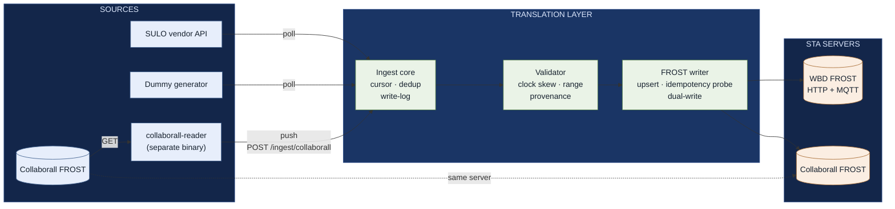

# Topic 2: what we learned from implementing OGC SensorThings API

**Testbed:** Geonovum 2026, topic 2 (connecting sensors to an OGC SensorThings API server)
**Implementing party:** Clappform B.V.
**Servers we worked against:**
`https://sta.wbd-rd.nl/FROST-Server/v1.1` (Waterschap Brabantse Delta, we write to it)
`https://sta-server.collaborall.net/v1.1` (Collaborall, we read from it and also write to it)
**Date:** 2026-07-27

---

## Executive summary

We built a translation layer that moves sensor observations into OGC SensorThings API servers.
SensorThings (STA for short) is an open standard for publishing sensor data over plain HTTP, so
any client that speaks it can read any server that speaks it.

Then we did something that was not in the original scope, and learned more from it: we used the
same codebase to *read* another organisation's STA server and copy its data into ours. Two
directions, two independent server deployments, one entity model.

The headline finding is about where the work goes, not about a single defect:

> **Conforming to the standard was the cheap part. Everything around it, meaning transport,
> authentication, server-specific behaviour, concurrency, idempotency and semantics, is where the
> engineering actually went.**

Of that surrounding effort, the part caused by gaps in the standard itself clusters in four places:
semantic vocabulary, entity and observation identity, capability discovery, and loosely typed
fields. Section 6 covers all four, in that order of importance.

The strongest argument for STA came out of the second integration. We pointed our reader at a
completely unfamiliar organisation's server: 46 observed properties, 460 datastreams, and a
domain (pump telemetry, seismics, air quality) with no overlap at all with our own waste
containers. It took days. No bilateral agreement, no vendor SDK, no schema exchange, and no
conversation with the other party's engineers. Every vendor API integration we have ever done
cost more than that. Section 7 makes that case in full.

---

## 1. What we built

### 1.1 Shape of the system



There are three deliberate seams in the system.

**The adapter contract.** Every source produces the same canonical `Thing`, `Datastream` and
`Observation` types, whether it is a polled vendor API, a pushed webhook or another STA server.
Nothing downstream knows where the data came from. Adding the Collaborall source needed no change
to the ingest core, the validator or the writer, beyond loosening two type constraints (see 4.6).

**The ingest core.** It resolves the STA entity chain (Thing, Location, Sensor, ObservedProperty,
Datastream, FeatureOfInterest), writes observations, records a write-log keyed on
`(datastream_id, phenomenon_time)` and advances a stored per-stream cursor. The cursor and the
write-log together are what make the pipeline safe to restart and able to fill gaps.

**The FROST writer.** It upserts entities by name, probes for existing observations before
writing, and supports two transports for observation creates: HTTP `POST` or MQTT publish over
WebSockets. Entity upserts always go over HTTP. Several targets can be written in parallel, which
we use for dual-write.

### 1.2 The two integrations

|           | **WBD (Brabantse Delta)**                                   | **Collaborall**                                        |
| --------- | ----------------------------------------------------------------- | ------------------------------------------------------------ |
| Direction | We**write**                                                 | We**read**, then write back into our destination       |
| Domain    | Waste-container fill level                                        | Pump pressure and flow, air quality, CO₂, seismics, weather |
| Scale     | 5 Things, 5 datastreams, 1,400+ observations                      | 46 ObservedProperties, 460 datastreams                       |
| Transport | HTTP POST**and** MQTT (`wss`), both validated             | HTTP                                                         |
| Auth      | HTTP Basic (`write` account)                                    | HTTP Basic                                                   |
| Server    | **Customised** FROST build (project-scoped authz extension) | Stock FROST-Server                                           |
| Purpose   | Prove the write path end to end against a live shared server      | Prove STA as a source, and portability between servers       |

### 1.3 The build decisions that mattered

**We built a translation layer instead of connecting sensors to STA directly.** Our sources are
vendor APIs and ERP systems, not devices we can reprogram. A layer in between keeps vendor
concerns (auth, pagination, rate limits, wire formats) behind one contract, and lets the same
validated write path serve any future source.

**We hand-rolled an STA client on top of `net/http` instead of using a third-party STA library.**
This looked like the more expensive option and turned out to be the cheaper one. STA's wire format
is plain JSON with OData-style query parameters, so the client is a few hundred lines. In return we
kept the upsert and idempotency behaviour explicit and easy to inspect, which is exactly where the
subtle problems in section 4 showed up. A library would have hidden them rather than prevented
them. That is a finding about the standard in itself: it is small enough to implement directly.

**We built a synthetic "dummy" adapter first.** Deterministic, clearly labelled fake containers
(`properties.synthetic = "true"`, names prefixed with `Dummy `) let us exercise the whole chain
against the live WBD server before any real sensor connector existed. No vendor dependency, no
risk of polluting real records, and a one-command run that reviewers can reproduce. It paid for
itself several times over: every finding in 4.1 to 4.5 was discovered with synthetic data.

**We made the reader a separate binary that pushes through our own ingest endpoint.** The
Collaborall reader (`cmd/collaborall-reader`) does not write to FROST directly. It reads the
source and POSTs canonical envelopes to `/ingest/collaborall`, so replicated data passes through
the same validation, mapping and dual-write path as everything else. One code path to trust, and
the reader still deploys on its own. It keeps its own cursor file, and a re-run is safe because
the service's write-log removes duplicates.

---

## 2. Reliability properties we demonstrated

All of these were validated against live servers, not local mocks.

- **End-to-end persistence.** The full Thing, Datastream and Observation chain was created and
  read back through the public API.
- **No duplicates.** Observations formed a contiguous 5-minute series, and the stored count
  matched the number of distinct cadence ticks (16, then 455, then 1016, then 1423 across the
  run), even though MQTT publish offers no server-side uniqueness guarantee.
- **Restart-safe gap recovery.** A gap of several days between runs was filled from the stored
  cursor with no duplicates.
- **Transport resilience.** The MQTT/WebSocket session dropped once and reconnected within about
  300 ms. Publishes during the gap were retried.
- **Concurrency safety.** After the fix in 4.4, a `-race` regression test asserts that N
  concurrent resolutions of one shared entity name produce exactly one POST.
- **Two transports, one mapping.** Observation writes were confirmed over both HTTP POST and MQTT
  publish, with no change to the entity mapping.

---

## 3. Where the effort actually went

This is relative and qualitative, and it answers the testbed's question about the practical
effort of exposing sensor data through a common standard.

| Area                              | Effort                   | Why                                                                                                          |
| --------------------------------- | ------------------------ | ------------------------------------------------------------------------------------------------------------ |
| STA entity mapping and write path | **Low**            | The entity model is well specified and complete. Mapping and name-keyed upsert were mechanical.              |
| Concurrency and idempotency       | **Medium to high** | The shared-entity upsert race, and observation idempotency under real latency, needed real fixes.            |
| Authentication                    | **Medium**         | Reads are authenticated too, and an empty password returns 500 instead of 401.                               |
| Server-specific behaviour         | **Medium**         | The customised WBD profile, and a server rejecting a`Sensor.metadata` payload the spec allows (see 4.7).   |
| Semantic reconciliation           | **Medium**         | Duplicate ObservedProperty names, placeholder units, four vocabularies for one concept. Not fixable in code. |
| Network and transport             | **Medium**         | Timeouts, MQTT reconnects and slow paths during back-fill all needed handling.                               |
| Reading an unfamiliar STA server  | **Low to medium**  | 460 datastreams, unknown domain, no documentation, no contact, and still only days. See section 7.           |
| Reproducibility and tooling       | **Low to medium**  | Dummy adapter plus a one-command`docker compose`.                                                          |

Read the table as one sentence: conforming to the standard was cheap, and production robustness
against a real network, a real auth scheme and a real (non-stock) server is where the engineering
lived. That second cost exists whether or not you use a standard, which is exactly why adopting
one is close to free. Section 7.3 expands on this.

---

## 4. Problems we ran into

Each entry covers what we saw, why it happened, what we did about it, and whether it is closed.

### 4.1 Authentication edge cases

Two separate problems, both cheap to fix and expensive to diagnose.

**Reads are authenticated too.** We first attached Basic credentials only to writes. But our
upsert starts with a `GET ?$filter=name eq …` probe, and WBD authenticates every request, so
entity resolution failed before any write was even attempted. Credentials now go on every
request.

**An empty password returns HTTP 500, not 401.** FROST-Server's `BasicAuthFilter` splits the
decoded `user:pass` string on the colon and assumes two fields. An empty password produces a
one-element array, an `ArrayIndexOutOfBoundsException` and a 500. Useful rule of thumb for
operations: a 500 from this endpoint usually means a missing or empty credential, not an outage.

**Closed.** Both are fixed on our side. The 500 is a robustness issue in FROST that is worth
reporting upstream.

### 4.2 "FROST-Server" is not one thing

The WBD deployment is not a stock build. Things expose non-standard navigation properties
(`Configurations`, `ControlledDevices`, `DeviceSecrets`, `Projects`) and a `restricted` boolean on
each entity. Together these form a project-scoped authorization and device-management extension.

Our live concern was whether new entities would need an explicit Project association, or would be
blocked by the `restricted` model. They were not. A standard STA `POST` of a new Thing was
accepted and created with `restricted: false`, and no Project association was required.

**Closed for the testbed, still open as an integration-contract item.** The lesson is that an
integration contract must not assume a stock server, and that a deployment's authorization model
stays invisible until you probe it.

### 4.3 Entity names collide on a shared server

We write into a FROST-Server that is shared with other testbed parties. Our name-keyed upsert
(`GET ?$filter=name eq 'X'`, then create if absent) will happily bind to someone else's entity
that happens to be named `X`, and our entities equally pollute their namespace. STA has no concept
of ownership, tenancy or namespacing, so nothing prevents this.

**Resolution.** A configurable `ENTITY_NAME_PREFIX` (for example `CF_`) is applied to every entity
name the layer creates. The mapper exposes a single set of `*EntityName` methods, so the upsert
probe and the created payload can never disagree about the name. **Closed**, though it is a
workaround for a missing concept rather than a fix.

### 4.4 A concurrency race that silently duplicated shared entities

**What we saw.** On WBD, the ObservedProperty `Fill level` and the Sensor
`Dummy fill-level sensor DUMMY-1 1.0.0` each existed five times.

**Why.** The scheduler resolves Datastreams concurrently, one goroutine each, sharing one
`Writer`. Entity upsert is check-then-act: cache miss, then `FindByName`, then POST if absent.
Entities with per-container unique names (Thing, Location, Datastream, FeatureOfInterest) never
collide. But Sensor and ObservedProperty are shared across all five datastreams, so five
goroutines each saw the entity as absent and each POSTed a copy. Two defects underneath: the
in-memory entity cache was an unsynchronised map, which is a genuine data race, and check-create
was not atomic per key.

**Why the standard is implicated.** FROST does not reject duplicate names, and it is right not to,
because STA does not require entity names to be unique. So there is no 409, no error and no
signal. The race produces silently wrong data, and our existing conflict-refetch branch never
fired. This is the clearest example we found of a gap in the standard causing an implementation
bug. See 6.2.

**Resolution.** A mutex-guarded cache plus a `singleflight` group keyed on `(entity, name)`, so
concurrent first-sight creates collapse into one `FindByName` and one POST. This sits in the
writer layer, independent of scheduler concurrency, and is backed by a `-race` regression test.
**Closed.** Cleaning up the redundant entities already created on WBD is still outstanding.

**Impact.** Low functional risk, because name lookups resolve to the lowest `@iot.id` and the
stored observations are correct. But it is real data-quality debt, and the map race could have
caused a panic under load.

### 4.5 Idempotency costs throughput, and it bit us during back-fill

Every observation, on both transports, is gated by a synchronous HTTP probe
(`GET …/Observations?$filter=phenomenonTime eq …`) before we write it. During a multi-day
back-fill over a high-latency path, that probe rather than the write became the bottleneck. It
repeatedly hit the client timeout while MQTT publish kept up easily.

**Resolution.** The FROST HTTP timeout is now configurable (`FROST_HTTP_TIMEOUT_SECONDS`, default
15s) so it can absorb slow paths. **Closed.**

**A known optimisation we have not built yet.** When the stored cursor already guarantees that an
observation is new, the probe is redundant and could be skipped entirely, which removes a
synchronous round-trip from the MQTT fast path. Today we pay a network round-trip per observation
for a guarantee the standard could give us server-side. See 6.2.

### 4.6 The second source was nothing like the first, and it broke our canonical model

**What happened.** We scoped the Collaborall integration expecting fill-level data. There was
none. We found 460 datastreams of pump pressure and flow, indoor and outdoor air quality, CO₂,
particulates, motion, noise, light, ground acceleration on three axes, and a full weather station.
Our fill-level-only filter would have mapped zero of them.

The shapes did not fit either:

- **Non-numeric results.** `OM_TruthObservation` results are booleans (`motion`), and
  `OM_CountObservation` results are integers (`light_level`). Our canonical `Observation.Result`
  was a `float64`, and our FROST payload typed `result` as `float64`.
- **Arbitrary phenomena.** Our `ObservedProperty` was a closed enum with `FillLevel` as its only
  v1 member, and both the push endpoint and the mapper filtered on it.
- **Placeholder and null units.** Some `unitOfMeasurement` fields are literally `"..."`.

**Resolution: generalise instead of special-casing.** We added an optional passthrough mode
alongside the existing fill-level mode.

- `canonical.Observation` gained `ResultRaw json.RawMessage`, which carries the verbatim STA
  result, and `frost.Observation.Result` became `any`. Numeric vendors are unaffected.
- The validator skips numeric range and NaN checks when `ResultRaw` is set, because a boolean has
  no range.
- `canonical.Datastream` gained optional `Passthrough*` fields (source names, unit triple,
  `observationType`, sensor name). When they are present the mapper reproduces the source entity
  faithfully. When they are absent it falls back to the fill-level defaults, so existing adapters
  are untouched.
- The push endpoint no longer filters on fill level. The observed-property string is now the
  per-Thing stream key.
- Placeholder units (`"..."`) are blanked at the source boundary instead of being passed on.

**Closed.** The change stayed contained: the ingest core, state store, dual-write and MQTT paths
needed no modification, which is the adapter seam paying off.

**Lesson.** Our model was over-specialised. The standard's was not. STA already had
`OM_TruthObservation`, `OM_CountObservation` and an untyped `result`. We had narrowed it and then
had to widen it back. When you map onto a general standard, resist encoding your first use case's
assumptions into the canonical layer. The standard is telling you where the variability is, and it
is worth listening.

### 4.7 The same payload is valid on one STA server and rejected by another

**What we saw.** `POST /Sensors` against Collaborall:

```json
frost http 422: {"error":{"code":"STA-422","message":"The metadata field must be a string.","target":"metadata"}}
```

The identical Sensor payload succeeds against WBD.

**Why.** We serialise `Sensor.metadata` as an inline JSON object:

```json
{ "encodingType": "application/json",
  "metadata": { "model": "DUMMY-1", "firmware_version": "1.0.0" } }
```

**What the specification actually says.** We checked the normative text, because it determines
whose defect this is. OGC 18-088 (STA 1.1), Table 13, types `metadata` as **"Any (depending on the
value of the encodingType)"**, mandatory. Table 15 lists three encodingTypes (`application/pdf`,
SensorML, `text/html`), and the accompanying prose states that **"Other encodingTypes are
permitted"** and that the metadata property "may contain either a URL to metadata content ... or
the metadata content itself (in the case of `text/plain` or other encodingTypes that can be
represented as valid JSON)".

An inline JSON object under `encodingType: application/json` therefore sits inside the
specification, and **nothing in the standard requires `metadata` to be a string.** A server that
rejects a JSON object with "The metadata field must be a string" is enforcing a constraint the
specification does not state. That is a server-side defect, not a standoff between two defensible
readings.

We cannot tell from the outside whether the strictness originates in that deployment's build, its
configuration, or an upstream FROST version difference. The WBD server runs a customised build, so
the two are not a clean comparison. The finding is worth reporting to the operator either way.

**Where the standard still contributes.** The same passage closes with "It is up to clients to
perform string parsing necessary to properly handle metadata content", and all three enumerated
encodingTypes carry string-shaped content. An implementer reading that could reasonably type the
column as a string. The declared type is `Any`; the surrounding prose assumes a string. That mixed
signal is what makes this mistake easy to make, which is why 6.4 asks for the loose typing to be
pinned down rather than asking only for a bug fix.

**Impact.** Sensor registration fails, so the whole Datastream chain that references it fails. Our
error classifier also treats the 422 as transient and retries a payload the server will never
accept.

**Open.** The plan of record is to serialise `metadata` as a JSON-encoded string, which satisfies
"must be a string" while preserving the structure, to make the serialisation per-target since one
server accepts objects and the other does not, to classify `STA-422` as permanent rather than
retryable, and to report the rejection to the operator.

This remains the most instructive interoperability finding in the testbed, and the lesson survives
the reattribution. **A server can present itself as STA-conformant and still reject a payload the
specification allows.** Conformance claims are not self-verifying, which is the argument both for
testing against several implementations (see 7.7) and for publishing a test suite that a candidate
server must pass (see recommendation 3). See also 6.4 for the part of this the standard should
tighten.

### 4.8 Real-world STA data can be semantically messy

The Collaborall server is a well-formed STA server carrying data that is hard to consume.

- **Duplicate ObservedProperty names** with different `@iot.id`s and different definitions.
  Several distinct `co2_levels`, `gauge_pressure`, `battery_level` and `temperature_indoor`
  entries, with definitions drawn variously from QUDT, Wikipedia, DBpedia and CF conventions.
- **Placeholder or null `unitOfMeasurement`** values (`"..."`, `null`).
- **One node maps to many datastreams, one ObservedProperty maps to many sensors**, with no
  consistent naming convention across them.

None of this breaks STA. All of it means a consumer cannot answer "give me all CO₂ readings in
this area" without a human-curated mapping. Syntactic interoperability was achieved. Semantic
interoperability was not. This is the gap a national profile is best placed to close (see 6.1),
and in our view it is the highest-value thing Geonovum could add on top of the standard.

### 4.9 Smaller things worth recording

- **`phenomenonTime` is polymorphic.** The same field is either an instant
  (`2026-01-02T03:04:05Z`) or an interval (`start/end`). Every consumer has to handle both. Ours
  parses it and takes the interval start.
- **`@iot.id` order is not input order.** Concurrent creation means server ids reflect completion
  order (`96` for `DUMMY-0001`, `97` for `DUMMY-0003`, `99` for `DUMMY-0002`, and so on).
  Harmless, since entities are resolved by name, but confusing when you reconcile by hand.
- **MQTT publish is fire-and-forget.** There is no ack and no server response, so persistence can
  only be verified with a REST read-back. That is correct behaviour, but it means the MQTT path
  cannot report its own success, and monitoring has to be built separately.
- **Naming drift.** Our vendor id was `collaboroll`, while the actual host is `collaborall`.
  Trivial, but it spread into the ingest path, package names and destination entity names before
  we caught it. Pin external identifiers early.

---

## 5. What the standard does well

Each of these was earned during implementation rather than read off the specification.

### 5.1 The entity model is complete enough to need no extensions

We mapped a domain the standard's authors plainly did not have in mind, municipal waste
containers, onto Thing, Location, Sensor, ObservedProperty, Datastream, Observation and
FeatureOfInterest with no extensions and no compromises. A container is a Thing, its position is a
Location, the fill sensor is a Sensor, "fill level" is an ObservedProperty, and the pairing is a
Datastream. We then mapped pump telemetry, seismics and weather onto the same seven entities
without touching the mapping layer. A model that absorbs both without strain is a well-designed
model.

### 5.2 `properties` is an extension point that costs no conformance

Every entity carries a free-form `properties` bag. We used it for vendor native ids, source-system
tags, an `area` label, a `synthetic` marker, expected cadence and first-seen timestamps. STA
models none of that, and we needed all of it. Nothing we carry forces a non-standard field onto
the wire, so our data stays readable by any STA client while losing nothing from the source. This
is the feature that makes adopting the standard a non-destructive decision: you do not have to
throw away your vendor-specific data to conform.

### 5.3 One uniform query surface, no SDK required

`$filter`, `$count`, `$expand`, `$orderby` and `$top` over plain HTTP meant that:

- our entire upsert is `GET ?$filter=name eq '<escaped>'` followed by a `POST`, with no vendor API
  involved;
- verification is `curl`, reproducible by any reviewer with no tooling
  (`GET /Things?$count=true&$filter=startswith(name,'Dummy')`);
- `$expand` let the reader inline Locations onto Things and Sensor plus ObservedProperty onto
  Datastreams, so reconstructing the entity graph costs one request per level instead of one per
  related entity;
- `$filter=phenomenonTime gt <cursor>` with `$orderby` and `$top` is an incremental-sync primitive
  we got for free: it is exactly the query a cursor-based reader needs, and we did not have to
  negotiate it with anyone;
- our client is a few hundred lines of `net/http`.

Compare that with a typical vendor telemetry API: bespoke pagination, bespoke filtering, a
proprietary SDK, and no way to express "count the things whose name starts with X".

### 5.4 Navigation-scoped creation

`POST /Things(96)/Locations` creates the Location and the association in one request. No separate
link call, and no risk of an orphaned entity between two writes. Small feature, materially simpler
write path.

### 5.5 Two transports, one entity model

STA specifies a REST interface and an MQTT interface over the same entities. We switched
observation writes from HTTP POST to MQTT publish over WebSockets with no change to the mapping
layer at all: same payload, different pipe. Being able to change transport characteristics without
touching your data model is unusual and valuable. Our MQTT run sustained a multi-day back-fill
that HTTP was struggling with.

### 5.6 Self-describing enough for a generic reader

This is the strongest property of the lot. `@iot.selfLink` and navigation links on every entity
mean a client can walk a server it has never seen, with no prior knowledge of its contents. Our
`collaborall-reader` enumerates Things, follows each to its Datastreams (with Sensor and
ObservedProperty inlined), reads Observations per stream, and reconstructs the entity graph. It did
that against a server whose domain we did not know, whose operators we never spoke to, and for
which no documentation exists.

This is what turns STA from a data format into an integration strategy. Section 7 is essentially
an elaboration of this paragraph.

### 5.7 A server can be both a source and a sink

Because the same model describes both directions, the same client code serves both. Our
`internal/frost` package holds a `reader.go` next to `writer.go`, sharing the same entity types.
Replicating one STA server into another is therefore a small program, not a project. Federation,
mirroring, aggregation and archival all follow from this for free.

### 5.8 There are standard homes for provenance and idempotency metadata

`Observation.resultQuality` and `Observation.parameters` gave us standard places for
`validated_by` and `validation_version` provenance, and for the vendor idempotency key
(`parameters.raw_observation_id`), without polluting `result` or inventing a side channel. Our
observations describe how they were processed, and any STA client can read that.

### 5.9 Non-numeric observations are already in the model

`OM_Measurement`, `OM_TruthObservation`, `OM_CountObservation` and friends, all with an untyped
`result`. As 4.6 recounts, the standard was more general than our canonical model, and that
generality was correct.

---

## 6. The four biggest things we would improve

Ordered by importance rather than by what they cost us. The two at the top are the ones that limit
what the standard can deliver, not the ones that took us longest. Each item states the concrete
problem we hit and a concrete change, either to the standard or to a national profile layered on
top of it.

### 6.1 Bind the semantics: a controlled vocabulary for definitions, UCUM for units

**Problem.** `ObservedProperty.definition` is a free URI and `unitOfMeasurement` is free text. In
real data (see 4.8) that produces four different `co2_levels` ObservedProperties with definitions
from four different vocabularies, and units that are literally `"..."`. A consumer cannot reliably
ask for "all CO₂ measurements in this region" across servers, or even within one server.

**Why this is first.** It is the only item on the list that limits the standard even when every
implementation is correct. Everything else here makes STA harder to implement; this one makes the
result less useful after you have implemented it perfectly. Syntactic interoperability is achieved,
semantic interoperability is not, and semantic interoperability is what a data consumer actually
wants.

It is also the only item that can be fixed without changing the specification, which gives it the
most realistic route to being fixed at all.

**Proposed change.** At the standard level: require `definition` to resolve to a term in a declared
vocabulary, and require UCUM for `unitOfMeasurement.symbol`. At the national-profile level, which
is our recommendation to Geonovum: mandate a specific vocabulary per domain, require UCUM, and
publish a profile that can be checked for conformance. This is the single highest-value thing a
Dutch STA profile could specify, because it is exactly the layer the base standard deliberately
leaves open, and exactly the layer where a national ecosystem gains from agreement.

### 6.2 Give entities and observations an identity story

These were two findings for us, at two different altitudes, but they share one root cause: **STA
defines no natural-key identity, so every writer has to implement check-then-act.** At entity level
that races. At observation level it forces a probe before every write.

**Problem, at entity level.** STA specifies no uniqueness constraint on `name` or any other natural
key, no server-side upsert, and no conditional create. So every integrator re-invents
check-then-act: `GET ?$filter=name eq …`, then POST. That is an extra round-trip per entity, and it
is racy. We hit exactly this and produced five copies of two entities (see 4.4).

**Problem, at observation level.** `(Datastream, phenomenonTime)` is a natural key in every real
deployment, but nothing enforces it. Re-polling, back-filling or retrying after a timeout can
duplicate observations, and MQTT publish is fire-and-forget with no ack at all, so you cannot even
tell whether your write landed. We built a Postgres write-log and a synchronous per-observation
`GET` probe to compensate, and that probe became our throughput bottleneck during back-fill
(see 4.5).

**Why it matters.** Two reasons, and the second is the serious one.

First, cost. This is the largest piece of infrastructure the standard pushes onto its clients. A
write-log, a persisted cursor and a probe before every write is not a small amount of code, and
every reliable STA producer has to build it.

Second, and worse: **the entity-level failure is silent.** FROST does not reject duplicate names,
and it is right not to, because STA does not require them to be unique. So there is no 409, no
error and no signal, just quietly duplicated data. The standard makes the naive implementation the
incorrect one and gives the implementer no feedback that they got it wrong. Anyone writing to STA
concurrently either has this bug or has independently found and solved it.

**Proposed change.** For entities, in order of preference:

1. A standard **idempotent create**: a client-supplied natural key, or an `If-None-Match`-style
   conditional POST, that returns the existing entity instead of a duplicate.
2. A way for a server to **declare a uniqueness constraint** (for example `Sensor.name` is unique)
   and return a 409 on violation. That alone is enough for a client to converge safely.
3. Failing both, a **normative upsert-by-name pattern** in the specification, so implementers do
   the same racy thing in the same documented way instead of each discovering the race in
   production.

For observations: define an optional but discoverable **dedupe on natural key**, where the server
ignores or updates a duplicate `(Datastream, phenomenonTime)` instead of creating a second row, and
give the MQTT path an acknowledgement mechanism. Together those remove the probe entirely and make
the fast path actually fast.

### 6.3 Require a machine-readable capabilities document

**Problem.** We discovered everything by probing, one request at a time: which extensions exist,
whether MQTT is available, which auth scheme is required, whether duplicate names are rejected,
what the page size is, and whether the server is a stock build or carries custom entities and an
authorization model (see 4.2). None of that is discoverable from the service root, which lists
collections and little else. Every one of those probes was a manual investigation.

**Why it matters.** It makes onboarding a human task, and it makes generic clients defensive and
slow. OGC API - Features solved exactly this with a required `/conformance` endpoint. It is also
the cheapest item on this list to specify, which is why it sits above 6.4 despite costing us less
in absolute terms.

**Proposed change.** A required machine-readable capabilities document that declares supported
conformance classes and extensions, transports, auth schemes, limits, and any non-core entities.

### 6.4 Pin down the loosely typed fields, and make rejections classifiable

**Problem.** `Sensor.metadata` is declared as `Any`, its shape is said to be governed by
`encodingType`, only three encodingTypes are enumerated, and the same passage that permits others
tells clients to perform "string parsing". As 4.7 records, one server took that as licence to
require a string and rejected a payload the specification allows. **The defect was the server's;
the ambiguity that invited it is the standard's,** and this item asks only for the second half.

The rejection then compounds it. `STA-422` is a FROST-specific code, and nothing in the standard
tells a client whether a rejection is permanent or transient. Ours classified the 422 as transient
and retried, indefinitely, a payload that server was never going to accept.

**Why it matters.** A field declared `Any` with prose pulling the other way is an invitation to
divergent implementations, and divergence in the *core* entity set is what breaks the assumption
most adopters start with, that "STA-conformant" implies "portable". Without a classifiable error
model, each divergence becomes a retry bug as well as a compatibility bug.

**Proposed change.** State normatively how `metadata` is encoded when `encodingType` is a JSON
media type, and reconcile the "string parsing" sentence with the declared `Any` type. Either
answer is workable; the specification should not imply both. More broadly, audit the fields
declared `Any` and give each a normative encoding per `encodingType`. Separately, define normative
error codes for the common failure classes, with an explicit permanent-versus-transient
distinction, so clients can implement correct retry behaviour without per-server heuristics.

### Smaller items we are not expanding here

Three further gaps cost us less but are worth reporting: bulk observation insert is an extension
rather than core, so a portable client cannot rely on it and 1,400 observations meant 1,400 POSTs
plus a probe each; there is no multi-tenancy or ownership model (see 4.3); and `phenomenonTime`
polymorphism forces every consumer to write the same defensive parser (see 4.9).

---

## 7. Why other organisations should adopt the standard

This is not a general argument for standards. It is the specific case our two integrations made.

### 7.1 The evidence: integrating a stranger's server took days

We pointed our reader at `sta-server.collaborall.net`, an organisation we had no integration
agreement with, whose data we had never seen, in a domain (pump telemetry, seismics, air quality)
with no overlap with our own. We had a base URL and a set of credentials.

We did not have documentation, a schema, an SDK, a data dictionary, a sample payload, an API
changelog, or a single conversation with their engineers.

Working replication took days, and most of that was our own model being too narrow (see 4.6)
rather than the source being hard to read. For comparison, a typical vendor telemetry integration
in our experience takes weeks: read the docs, get a sandbox key, reverse-engineer pagination,
discover the rate limits the hard way, write bespoke parsing, then repeat all of it for the next
vendor.

That difference is the value proposition, and it is measurable.

### 7.2 Integrate once, be consumable by everyone

A bespoke API means N consumers times M producers, so N times M integrations, each needing its own
bilateral agreement. STA collapses that. Publish once, and every existing STA client can consume
you with no work on your side and no negotiation. The marginal cost of your second data consumer
is close to zero, and you never have to know who they are.

For a public body this is the decisive argument. You cannot list your future data consumers, so
you cannot negotiate with them in advance. A standard is how you serve consumers you have not met.

### 7.3 You are already paying the hard costs

Section 3 is the uncomfortable finding for anyone arguing that standards are expensive. The effort
went into network access, authentication, server behaviour, concurrency and idempotency, and every
one of those costs is identical whether you expose a bespoke API or an STA endpoint. Ingestion
reliability is hard because ingestion is hard, not because STA is hard. The STA-specific part was
the cheapest line in the table.

So the incremental cost of conforming is small and the interoperability upside is
disproportionate. Bespoke is not cheaper. It is the same price with none of the benefit.

### 7.4 You do not have to build the server

Mature open-source implementations exist. FROST-Server, which both of our targets run, is one.
Adopting STA as a publisher can mean deploying software rather than writing it. The build-versus-
adopt calculation is not "the standard versus our simple REST API". It is "deploy an existing
server versus design, build, document, version and support an API forever".

### 7.5 Conforming does not mean losing your data model

The `properties` bag (see 5.2) carried every vendor-specific field we had: native ids, source
system, cadence, provenance and synthetic markers, with no loss and no conformance cost. The
common objection, that the standard does not model our domain, is largely answered by this. Model
the 90% in standard entities and carry the rest in `properties`. You lose nothing, and the 90%
becomes interoperable immediately.

### 7.6 It is small enough to implement directly

Our production STA client is a few hundred lines of plain `net/http` (see 5.3). No SDK dependency,
no vendor lock-in, no version-upgrade treadmill. A standard you can implement in an afternoon from
the specification is a standard with genuinely low adoption risk, and that is not true of most
enterprise integration standards.

### 7.7 The honest caveat

Adopters should go in knowing section 6. "STA-conformant" does not guarantee portability between
servers. Test against more than one server implementation before you declare victory: we found a
hard portability failure (see 4.7) on the second server we touched, and we would have shipped it
undetected if we had tested against one — and note that the payload was one the specification
allows, so the server, not our client, was at fault. Conformance claims are not self-verifying.
Also expect to build idempotency yourself (see 6.2).
Neither of these changes the conclusion. Both change your project plan, and it is better to know
on day one.

---

## 8. Recommendations

**To Geonovum and the testbed programme**

1. **Specify a Dutch STA profile that closes the semantic gap** (see 6.1): a mandated vocabulary
   per domain for `ObservedProperty.definition`, UCUM for units, and a conformance checker. This
   is the highest value per unit of effort of anything on the list. It is precisely the layer the
   base standard leaves open, and precisely where a national ecosystem gains from agreement.
2. **Add namespacing guidance for shared, multi-party servers** (see 4.3): entity-name conventions
   and an ownership convention in `properties`, until the standard has a tenancy model.
3. **Publish an interoperability test suite** that a candidate server must pass, including the
   ambiguous cases: `Sensor.metadata` encoding, duplicate names, non-numeric result types and
   interval `phenomenonTime`. Section 4.7 argues for this more directly than anything else in the
   report: a server there rejected a payload the specification permits, and a published suite would
   have caught that before we did. Over-strict servers damage interoperability just as much as
   permissive ones, and nothing currently tests for them.
4. **Take section 6 to OGC** as implementation feedback from a real multi-server deployment. Each
   item is concrete, cheap, and backed by an incident in this report.

**To organisations considering STA**

5. Test against at least two independent server implementations before you call a client done
   (see 7.7).
6. Budget for the operational envelope, not the mapping (see section 3), and note that you would
   pay that cost anyway (see 7.3).
7. Build idempotency on `(Datastream, phenomenonTime)` from day one, and persist a cursor. The
   standard will not do it for you, and it is what makes back-fill and restart safe (see 6.2).
8. Prefix your entity names on shared servers (see 4.3).
