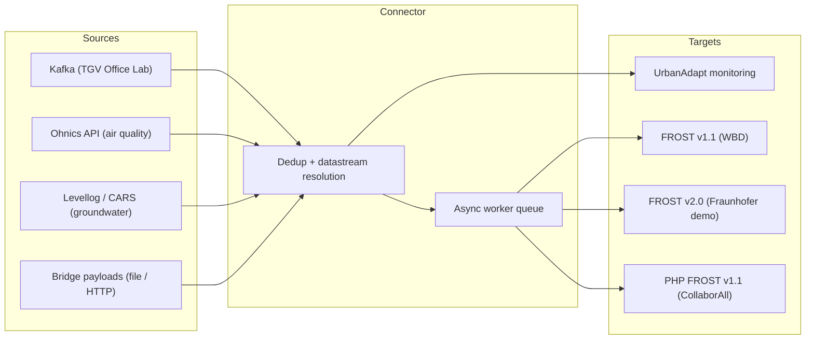

# Topic 2 Geo Insights: Connecting Climate Adaptation Sensors to SensorThings API

## Introduction

Geo Insights participated in this testbed as an Implementation Topic 2 contributor: connecting sensors to a central SensorThings API server. Our use case focused on climate adaptation monitoring at urban living labs, a domain where sensor data is fragmented across fieldlabs with incompatible infrastructure, governance models, and data formats. The OGC SensorThings API standard promised to be the interoperability layer that could make this data accessible and queryable across organizations.

We set out to connect sensors from three fieldlab locations:

- **The Green Village (TGV)**, TU Delft campus in Delft: an open innovation fieldlab for sustainable technologies and nature-based solutions, instrumented with indoor climate sensors, weather stations, and soil monitoring equipment.
- **Diergaarde Blijdorp**, Rotterdam: a 28-hectare zoo and urban delta site, instrumented for climate adaptation monitoring including heat stress, water buffering, and water quality.
- **EUR Campus**, Erasmus University Rotterdam: a university campus site with weather stations and soil moisture sensors, intended for climate adaptation monitoring as part of the green-blue infrastructure program.

Our approach was to build a generic, open-source connector service that bridges existing fieldlab sensor infrastructure with the central FROST server, rather than building bespoke point-to-point integrations. The connector simultaneously feeds observations to the testbed's central SensorThings server and to UrbanAdapt, our climate adaptation platform, demonstrating how standardized sensor data can serve both public interoperability and domain-specific applications.

The source code is publicly available at [github.com/Geo-insights/sensorthings-testbed-connector](https://github.com/Geo-insights/sensorthings-testbed-connector) under the MIT license.

## Approach and architecture

Rather than connecting sensors directly to the SensorThings API, we built an intermediary translation layer. This decision was driven by a practical reality: no sensor speaks SensorThings natively. Every data source we encountered required protocol translation, schema mapping, authentication handling, and error recovery before observations could be pushed to a FROST server.

The connector is a FastAPI service that ingests data from multiple sources, maps readings to the SensorThings entity model (Things, Sensors, ObservedProperties, Datastreams, Observations), and pushes observations to one or more FROST targets. It runs continuously as a deployed service with background polling loops.

In practice we ran three targets concurrently: a FROST v1.1 server (WBD), a
FROST v2.0 demo server (Fraunhofer), and a PHP-based FROST v1.1 server
(CollaborAll). The three implementations behaved differently enough that the
multi-target fan-out became our most productive source of interoperability
findings (see below).

Key architectural decisions:

- **Multi-source ingestion**: each data source has its own adapter and polling loop, accommodating fundamentally different protocols (Kafka with Avro, REST with OAuth2, public JSON endpoints, file-based bridge payloads).
- **Multi-target fan-out**: observations are pushed to multiple FROST servers concurrently (one thread per target via a thread pool), which proved essential for testing interoperability across server implementations and SensorThings API versions. A slow or unresponsive target no longer blocks the others.
- **Decoupled consume and push**: the Kafka consumer hands readings to a bounded async worker queue and commits its offset immediately, so the poll loop is never blocked by a slow multi-target FROST push. The worker coalesces queued batches and pushes them in the background. If the queue fills, the consumer falls back to an inline push; no data is ever dropped. This decoupling was the single most effective change for preventing Kafka consumer eviction under sustained load.
- **Negative caching of failed datastream lookups**: when a sensor has no matching datastream on a particular target, the failed lookup is cached with a five-minute TTL. Without this, every push cycle triggered a per-reading HTTP query storm against every target that lacked the datastream, dominating push latency for large coalesced batches.
- **Backlog-lag guard**: the connector monitors the age of the newest Kafka observation. When the lag exceeds a configurable threshold (default one hour), it raises an alert and can optionally skip to the latest offset, preventing unbounded backlog replay from crowding out live data.
- **Reliability patterns**: circuit breakers per target, a dead-letter queue for failed observations, batch chunking, and timestamp-based deduplication. These were not planned from the start but became necessary as we moved from prototype to continuous operation.
- **Self-healing and observability**: a stall watchdog that detects when an ingestion source goes silent and forces a reconnect, best-effort webhook alerting for stalls and authentication failures, a per-source freshness endpoint (returning HTTP 503 when data is stale) that an external uptime monitor can poll, and a liveness probe for the hosting platform (Render). These were added only after continuous operation surfaced recurring, silent stalls that no amount of single-run testing would have revealed.

## Implementation timeline

The project spanned roughly three and a half months, from initial scaffold to production operation and operational hardening. The commit history tells the story of how the implementation evolved:

| Date | Milestone | Commits |
| --- | --- | --- |
| 17 Apr 2026 | Project scaffold and MIT license | 2 |
| 22-26 May | First FROST connection, entity registration validated, bridge payload workflow | 2 |
| 3 Jul | Enhanced connector with test suite | 1 |
| 13-14 Jul | Kafka integration with TGV Office Lab via Confluent Cloud; Dockerfile and deployment to Render | 9 |
| 15 Jul | Major architecture refactor: layered design with custom exceptions, STA domain models, structured logging | 1 |
| 16 Jul | Ohnics air quality and Levellog groundwater polling sources added | 3 |
| 17 Jul | Deduplication sprint: 13 commits in one day fixing duplicate entities and observations across restarts. FROST v2.0 support added as third target. | 15 |
| 20-21 Jul | Performance optimization (push cycle from ~60s to ~6s), circuit breaker, dead-letter queue replay | 2 |
| 22 Jul | Multi-target hardening: fixed secondary targets using wrong datastream IDs, batch timeout tuning, documentation overhaul | 10 |
| 28 Jul | Multi-target robustness: per-target auth routing and no-auth support, registration resilient to primary-target outages, integer `@iot.id` coercion for the Collaborall PHP server, Kafka offset commit deferred until after FROST push, and dead-letter queue memory-safety (streamed replay, size cap, age expiry) | 5 |
| 3 Aug | Operational hardening under continuous load: root-caused and fixed a recurring silent Kafka stall (consumer eviction), added stall self-healing with a watchdog and webhook alerting, diagnosed and repaired the dead CollaborAll target, recovered from a dead-letter queue that had filled the persistent disk, and shipped write-capability discovery plus a replay-time deduplication probe | 7 |
| 4 Aug | Performance and resilience sprint: decoupled FROST push from Kafka consume loop via an async worker queue with coalescing, parallelised per-target push (concurrent threads instead of sequential), added negative caching for failed datastream lookups, added backlog-lag guard with optional auto-skip-to-latest, Render liveness probe, v2.0 dataArray batch push, and reordered monitoring push to fire before FROST | 5 |

Two patterns stand out. First, the intense burst on July 17th where 13 commits addressed deduplication issues. Duplicate observations accumulated because the entity cache was cleared on every redeployment, and without startup seeding from FROST, the connector would re-push all historical readings. This required querying the latest observation timestamp per datastream on startup and filtering accordingly. Second, the multi-target hardening on July 22nd revealed that pushing to multiple FROST servers exposed subtle incompatibilities that single-target testing never would have caught.

The August 3rd hardening phase is a third pattern worth calling out: it happened entirely because the connector ran continuously for weeks. Two failure modes only appeared under sustained load. First, the Kafka consumer was being silently evicted from its consumer group whenever a large post-backlog batch took longer to push to three targets than the broker's poll interval allowed; the connector then consumed nothing at all, with no error, until manually restarted. The fix was to lengthen the poll interval and cap the per-cycle batch size so a multi-target push always completes inside the poll window, backed by a watchdog that alerts and reconnects if a source goes silent. Second, the dead-letter queue file grew far past its intended cap and eventually filled the service's persistent disk, causing every subsequent disk write to fail. Neither failure is conceivable in a short-lived test; both are inevitable in production. This is the strongest evidence we have for the claim that production reliability cannot be an afterthought.

The August 4th sprint is a fourth pattern: a targeted performance pass that addressed the root cause the August 3rd fixes had only mitigated. Capping the batch size and lengthening the poll interval reduced consumer evictions but did not eliminate them. The fundamental problem was that a synchronous, sequential multi-target FROST push held the consume loop hostage. The fix was architectural: an async worker queue that decouples consume from push entirely, concurrent per-target threads so a slow target no longer serialises the others, and a negative cache that eliminates the per-reading HTTP lookup storm for sensors that have no datastream on a given target. Together these changes moved the push bottleneck out of the consume loop altogether.

## Fieldlab onboarding experiences

Each data source we connected had a fundamentally different integration path. This diversity is itself a key finding: the SensorThings API standard solves the *output* side of interoperability, but the *input* side remains entirely unstandardized.

### TGV Office Lab: Kafka and Confluent Cloud

The Green Village's indoor climate sensors (temperature, humidity, CO2, air pressure) publish to a Confluent Cloud Kafka topic using Avro serialization with a Schema Registry. Onboarding required: obtaining Confluent Cloud API credentials, understanding the Avro schema, mapping `measurement_id` values to SensorThings entities via a device mapping configuration, and handling Avro union types in deserialized records. Once connected, the data flows reliably at 5-minute intervals. This was the most technically demanding integration but also the most robust once established.

### Ohnics air quality: public REST API

The Ohnics SamenMeten network exposes outdoor air quality readings (PM2.5 and temperature) for sensors in Delft via a public JSON endpoint. No authentication, no registration, no credentials needed. The connector polls the endpoint every 5 minutes, discovers sensors by name prefix, and dynamically registers SensorThings entities for each discovered sensor. This was by far the easiest onboarding experience and demonstrates the value of publicly accessible sensor APIs.

### Levellog / CARS Online: OAuth2 and OData

Groundwater level sensors at TGV installations are managed via the CARS Online platform, which exposes an OData API secured with OAuth2 client credentials. Onboarding required: obtaining OAuth2 credentials, discovering installation UUIDs via a custom discovery script, understanding the proprietary API contract (POST with startDate/endDate/amountOfEntries), and mapping the response to SensorThings entities. Each installation needed to be individually configured with its UUID, name, and coordinates.

### Diergaarde Blijdorp: governance delays

Despite being confirmed in our tender as a primary fieldlab location, we have not been able to connect Blijdorp sensors during the testbed period. The challenge was not technical but organizational: coordinating access across institutional boundaries, clarifying data ownership, and obtaining credentials took longer than the testbed timeline allowed. The entity model for Blijdorp was registered as scaffolding in FROST (10 Things with Locations, Sensors, and Datastreams), proving that the SensorThings side was ready, but no live observations have flowed. This is an important lesson for future testbeds: governance and access provisioning can be a larger bottleneck than any technical challenge.

### EUR Campus: governance delays

The Erasmus University Rotterdam campus was included in our tender as a fieldlab site with weather stations and soil moisture sensors for climate adaptation monitoring. Like Blijdorp, the connector architecture and entity model are ready to receive the data, but access provisioning and institutional coordination have not been completed within the testbed period. The pattern is the same: the technical side is not the bottleneck.

### Key insight

The table below summarizes the contrast:

| Source | Protocol | Auth | Discovery | Onboarding effort |
| --- | --- | --- | --- | --- |
| TGV Office Lab | Kafka + Avro | API key + secret | Device mapping JSON | High |
| Ohnics | REST (JSON) | None | Automatic by prefix | Low |
| Levellog / CARS | OData + OAuth2 | Client credentials | Manual UUID discovery | Medium |
| Blijdorp | Unknown | Pending | Blocked on governance | Not completed |
| EUR Campus | Unknown | Pending | Blocked on governance | Not completed |

## Findings on the SensorThings API standard

### What worked well

The SensorThings API entity model proved to be a good fit for climate adaptation sensor data. The separation between Thing (the installation), Sensor (the instrument), ObservedProperty (what is measured), and Datastream (the specific combination) maps naturally to how fieldlabs organize their monitoring. The OData query capabilities (`$filter`, `$expand`, `$orderby`) were powerful for programmatic lookup of existing entities and for seeding deduplication timestamps on startup.

Most importantly, the standard delivers on its core promise: once data is in a SensorThings server, it is genuinely interoperable. Our observations are queryable by anyone with access to the FROST endpoint, using a standard protocol, without needing to know anything about the source infrastructure. This is exactly the kind of interoperability that climate adaptation practitioners need.

### Issues at the standard level

These issues were raised and discussed with other participants and server implementers in the [testbed GitHub repository](https://github.com/Geonovum/testbed-sensordata-2026/discussions). We opened discussions [#22](https://github.com/Geonovum/testbed-sensordata-2026/discussions/22), [#23](https://github.com/Geonovum/testbed-sensordata-2026/discussions/23), and [#24](https://github.com/Geonovum/testbed-sensordata-2026/discussions/24) ourselves; the others were started by fellow participants and reflect shared experiences across the testbed.

**Entity modeling is non-trivial ([discussion #22](https://github.com/Geonovum/testbed-sensordata-2026/discussions/22)).** The standard defines the entity types but provides no guidance on naming conventions, Thing granularity, or how to structure properties. Different implementers will model the same sensor installation in different ways, undermining the interoperability the standard aims to provide. For example: should a weather station with five parameters be one Thing with five Datastreams, or five Things? The standard allows both, but only consistent choices enable meaningful cross-dataset queries.

**Observation deduplication is left to the client, and it costs a round-trip per write ([discussion #23](https://github.com/Geonovum/testbed-sensordata-2026/discussions/23)).** The standard has no mechanism for idempotent observation submission. `(Datastream, phenomenonTime)` is a natural key in every deployment we saw, but nothing enforces it, so re-polling, back-filling, or retrying after a timeout can all create duplicates with no server-side protection. The safe-but-slow pattern is to probe (`GET …/Observations?$filter=phenomenonTime eq …`) before every write; the fast pattern is to write optimistically and treat an `HTTP 409 Conflict` as "already delivered", but that only deduplicates if the server actually enforces uniqueness and returns 409, which is undocumented and varies by implementation. We settled on the optimistic path plus three safeguards: startup seeding of the latest timestamp per datastream from FROST, deferring the Kafka offset commit until after the push succeeds, and an existence probe confined to the rare dead-letter replay path. This is a common need that should be addressed at the standard or server level, ideally as a *discoverable* dedupe-on-natural-key capability, so a client can tell whether the cheap path is safe rather than establishing it by trial. To make that concrete, we implemented the client half of exactly this idea: a capability-discovery step that records each server's advertised write capabilities (data-array batch support, client-specified IDs, and any duplicate-handling behavior). Today that information is incomplete and inconsistent across servers, which is precisely why a discoverable, standardized dedupe capability would remove guesswork rather than add to it.

**The v1.1 to v2.0 gap is significant ([discussion #17](https://github.com/Geonovum/testbed-sensordata-2026/discussions/17)).** When we added a FROST v2.0 target alongside our v1.1 servers, we discovered that the payload format differs substantially: `@iot.id` becomes a different field structure, `observationType` and `unitOfMeasurement` are replaced by SWE-Common `resultType`, and collection count fields use different names (`@iot.count` vs `@count`). We had to build a payload adaptation layer to support both versions. This transition path needs clear documentation and tooling support if v2.0 adoption is to succeed.

**Semantic interoperability stops where syntactic interoperability ends ([discussion #24](https://github.com/Geonovum/testbed-sensordata-2026/discussions/24)).** `ObservedProperty.definition` is a free URI and `unitOfMeasurement` is effectively free text. This openness is deliberate (no standard can enumerate every phenomenon in every domain), but it means a consumer cannot reliably answer "give me all CO2 readings in this area" across servers, or even within a single server, without someone hand-curating a mapping. Avoiding exactly that work is why organizations adopt standards in the first place. We addressed it on our own side by pinning every `ObservedProperty.definition` to a CF Standard Names URI and every `unitOfMeasurement.symbol` to a UCUM code (`Cel`, `%`, `[ppm]`, `deg`, `hPa`, `km/h`, `mm`, `W/m2`), never null or a placeholder. But this only produces interoperability if other parties converge on the same authorities. This is the layer a national profile is best placed to pin down, and it requires no change to the specification.

### Issues with server implementations

Testing against multiple FROST server instances revealed inconsistencies that single-server testing would have missed. Many of these were tracked in the testbed's shared bug-report thread ([discussion #10](https://github.com/Geonovum/testbed-sensordata-2026/discussions/10)):

- **`$expand` on Observations** did not work as expected on one server, requiring individual queries instead of batch expansion ([discussion #10](https://github.com/Geonovum/testbed-sensordata-2026/discussions/10)).
- **`resultQuality` format** differed between servers: one accepted a scalar string, another required an array. The same valid SensorThings payload was rejected by one server and accepted by another.
- **Entity ID types** differed: the Collaborall PHP server rejected string `@iot.id` values and required native integers, while FROST accepted both. The same reference payload had to be coerced per target ([discussion #12](https://github.com/Geonovum/testbed-sensordata-2026/discussions/12)).
- **FeatureOfInterest auto-resolution and deep-insert semantics** differed, and this silently killed an entire target. The CollaborAll PHP server rejected *every* observation with an `HTTP 409 Conflict` because its Things had no linked Location, so the server could not auto-generate a FeatureOfInterest for the observation. On the FROST servers the same entities worked. Worse, the standard remedy (a deep-insert of nested `Things` when POSTing the Location) was silently ignored by the PHP server, so the Thing and Location existed but were never associated. We only diagnosed this weeks in, because the failure was invisible: registration succeeded, the datastreams existed, and the observations returned 409 (which our optimistic dedup logic treats as "already delivered"). The fix was to explicitly PATCH-link each Thing to its Location on the secondary stacks. This is a sharp illustration that a server accepting your entities is not the same as a server accepting your observations, and that implicit FeatureOfInterest generation is under-specified across implementations ([discussion #10](https://github.com/Geonovum/testbed-sensordata-2026/discussions/10)).
- **Batch push behavior** (the CreateObservations dataArray extension) varied: a batch of 4,500 observations would succeed on one server but time out on another, requiring us to implement chunking (500 observations per request) and configurable timeouts ([discussion #18](https://github.com/Geonovum/testbed-sensordata-2026/discussions/18)).
- **Error response formats** for the same problem (e.g., a duplicate entity name) differed between server implementations, making generic error handling more difficult.

These are not failures of the standard itself, but they demonstrate that interoperability at the standard level does not automatically mean interoperability at the implementation level. Conformance testing for SensorThings servers would help.

### Source data challenges

The hardest interoperability problem we faced was not on the SensorThings side at all. It was getting access to the data in the first place. Each fieldlab has its own infrastructure, its own governance model, its own authentication mechanism, and its own data format. The SensorThings API standardizes the output, but the input side of the pipeline, where the real complexity lives, remains entirely ad-hoc.

Sensor metadata (make, model, calibration data, installation details) is rarely available in machine-readable form. We often had to discover sensor capabilities empirically by examining the data that arrived, rather than by consulting documentation. This makes entity modeling a trial-and-error process rather than a systematic one.

## Lessons learned

1. **A translation layer is essential.** No sensor speaks SensorThings natively. Every implementation needs a bridge, and the complexity of that bridge depends entirely on the source infrastructure, not on the standard.

2. **Multi-target testing reveals what single-target testing hides.** Pushing to multiple FROST servers simultaneously exposed payload format differences, timeout behaviors, and error handling inconsistencies that we would never have found with a single target.

3. **Production reliability is not optional.** Circuit breakers, dead-letter queues, batch chunking, and deduplication were not in our original design. They became necessary as we moved from prototype to continuous operation. The failures that ultimately mattered most were the ones that only appear under sustained load: a message-queue consumer silently evicted because a multi-target push outran its poll interval, and a dead-letter queue that grew past its cap and filled the disk. Both were invisible in testing and inevitable in production, which is why self-healing (watchdogs, forced reconnects), alerting, and an external freshness check belong in the design from day one, not after the first outage. Any implementation guide should address these patterns from the start.

4. **Decouple consume from push.** When a connector feeds multiple targets that each have their own latency and failure modes, the push must never block the consume loop. Our Kafka consumer was repeatedly evicted because a multi-target push took longer than the broker's poll interval. The fix (an async worker queue between consume and push) eliminated the evictions entirely and allowed the consumer to stay live while FROST targets catch up asynchronously. This generalizes beyond Kafka to any source with a liveness heartbeat: the ingestion loop should hand off to a bounded queue and commit as fast as it can.

5. **The hardest part is access, not technology.** Governance, credentials, institutional coordination, and data ownership took more calendar time than writing code. Two of our three fieldlab locations (Diergaarde Blijdorp and EUR Campus) could not be connected during the testbed period despite the technical side being ready. Future testbeds should front-load access agreements and credential provisioning, at least for fieldlabs.

6. **Entity modeling needs domain expertise.** Mapping sensors to Things, ObservedProperties, and Datastreams requires understanding both the SensorThings data model and the domain context. This is not a purely technical task and benefits from collaboration between domain experts and implementers.

## Public sessions

### Public session 1

At the kick-off session we introduced Geo Insights and our co-applicant Building Changes, presented our use case (connecting climate adaptation sensors from urban fieldlabs to the SensorThings API), and outlined our goals for the testbed: building an open-source connector, pushing to multiple FROST servers, and feeding observations into our UrbanAdapt platform. With the ultimate goal to create a national fieldlab sensornetwork and train a geospatial foundation model.

### Public session 2 (25 June 2026)

At session 2 the connector existed as scaffolding: 10 Things, 26 Datastreams, and 13 ObservedProperties were registered on the Brabantse Delta FROST server for The Green Village and Diergaarde Blijdorp, but no live sensor data was flowing yet; we were still waiting for real payload samples from the fieldlabs. The presentation introduced the connector architecture (FastAPI, entity registration, dead-letter replay, Node-RED bridge), demonstrated governance via the FROST Projects extension, and showed a working Tasking MVP end-to-end on the live server. Open questions posed to the audience included push-vs-pull per fieldlab location and how to populate `resultQuality` across sources with different reliability characteristics.

Presentation slides: [Public session 2 slides (PDF)](Geonovum%20sensordata%20testbed%20public%20session%202%20slides.pdf)

### Public session 3

By session 3 the project had moved from scaffolding to live operation. Three real data sources were connected (TGV Office Lab via Kafka with 5 sensors, Ohnics air quality via REST polling with 46 sensors, and Levellog groundwater via OData with OAuth2 with 3 sensors) and observations were flowing to all three FROST targets simultaneously (Brabantse Delta v1.1, CollaborAll v1.1, and the Fraunhofer v2.0 test server). The presentation walked through the engineering problems solved since session 2 (Avro union type handling, polling deduplication, multi-server fan-out with per-target auth and versioning) and gave a live demo of the UrbanAdapt Monitoring Module, which had been expanded with features inspired by another participant's RIME Observatory. The session closed with 101 datastreams live across 2 data sources feeding 2 servers, and a roadmap for onboarding Blijdorp, EUR Campus, Living Lab Binckhaven, and AMS Institute in the coming months.

Presentation slides: [Public session 3 slides (PDF)](Geonovum%20sensordata%20testbed%20public%20session%203%20slides.pdf)

## Recommendations

Based on our experience in this testbed, we offer the following recommendations for future SensorThings API adoption:

1. **Standardize fieldlab onboarding.** Develop templates for access agreements, credential provisioning, and data discovery that can be shared across fieldlabs. The governance overhead of connecting a new site was consistently larger than the technical effort.

2. **Publish entity modeling and semantic guidelines.** The SensorThings standard defines entity types but not modeling conventions or semantics. A best-practice guide covering naming, Thing granularity, property structures, a controlled vocabulary per domain for `ObservedProperty.definition`, and mandatory UCUM symbols for `unitOfMeasurement` would significantly improve cross-dataset interoperability. This is the layer a national profile gains most from agreeing on, and it requires no change to the specification.

3. **Address the v1.1 to v2.0 migration path.** Implementers need clear guidance on payload differences, migration tooling, and dual-version support. The current gap creates risk for early adopters.

4. **Consider standard-level deduplication.** Either add idempotent observation submission to the standard or document recommended deduplication patterns. Every implementer will face this problem in production.

5. **The testbed format works.** Working with a real use case, real sensors, and a shared central server generated practical insights that a specification review never would. Future testbeds should allocate more time for fieldlab onboarding and consider requiring access agreements to be in place before the implementation phase begins.

## References

- [Tender application (PDF)](Tender_Geonovum_Topic2_Geo_Insights_and_Building_Changes.pdf)
- [Source code repository](https://github.com/Geo-insights/sensorthings-testbed-connector) (MIT License)
- [UrbanAdapt monitoring module](https://github.com/Geo-insights/monitoring_module)
- [Testbed GitHub discussions](https://github.com/Geonovum/testbed-sensordata-2026/discussions) (interoperability findings filed as #22, #23, #24)
