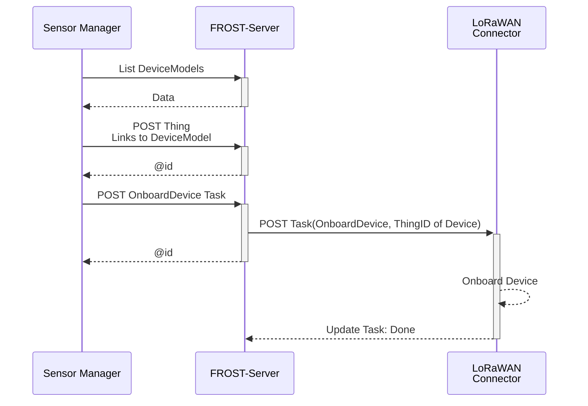
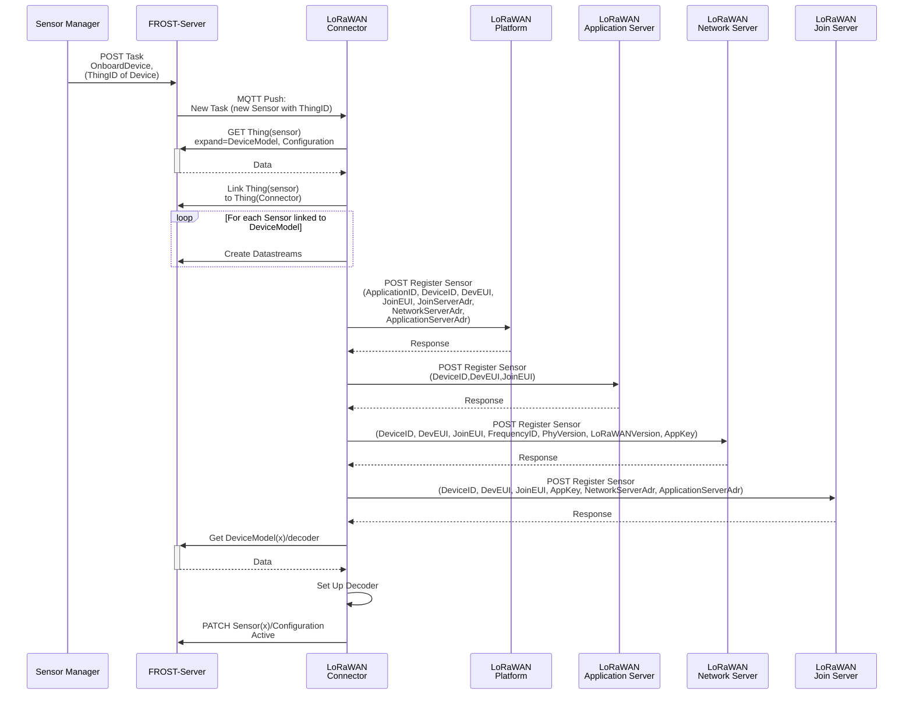

# Topic 1 Fraunhofer

## The OGC SensorThings API

The OGC SensorThings API is an implementation Data Model of OMS, combined with a Request/Response and a Publish/Subscribe API.
It is designed to enable the management and sharing of sensor data, allowing users to approach the data in the way that fits their use case.

The API consists of a data model based on the OGC/ISO _Observations and Measurements_ conceptual model, a REST-over-HTTP part for managing the data and accessing it using requests, and an MQTT part that enables push-notifications when data changes.


## FROST-Server


[FROST-Server](https://github.com/FraunhoferIOSB/FROST-Server) is the reference implementation of the SensorThings API.
It is licensed using the LGPL 3.0 license and implements all parts of the spec.
It is a Java-EE application and has Docker images available for easy installation.


### Deploying FROST-Server using Docker Compose

For this testbed a FROST-Server instance was deployed on the cloud environment of Brabandse Delta.
This cloud environment uses [Portainer](https://www.portainer.io/) to manage a Docker environment, and uses NGINX as a reverse proxy to route HTTP requests to the correct docker container.

When running in a container environment, FROST-Server consists of separate containers for the HTTP and MQTT parts of the API.
These containers have to state and can be duplicated as required to satisfy the load put on the system.
The separate FROST-Server containers communicate with each other using a message bus, so that when an update is made through one container, the other containers are notified so they can send push notifications to any users that have subscriptions on the changed entities.

<figure id="fig-deployment">
  
  <figcaption>A typical FROST-Server deployment.</figcaption>
</figure>

The data that is managed by the system is stored on a PostgreSQL database server with PostGIS extensions.
This database server writes the data to a persistent volume, which is the only part of the system that is persitent over restarts.

In a docker environment the deployment of a composite system with sub-systems is configured in a docker-compose.yaml file.
A basic docker-compose file consists of a name, a set of services and a set of persistent volumes.
The name is used as a prefix to name containers.
The volumes are the file systems that persist across restarts of the services.
The services specify which containers are generated, and which settings are used for these containers.
The basic structure of a docker-compose file for FROST-Server is shown in the following example:

```yaml
name: myFROST
services:
  nginx: (Usually defined externally)
    image: nginx:1-alpine
    [...]

  frosthttp:
    image: fraunhoferiosb/frost-server-http:latest
    [...]

  frostmqtt:
    image: fraunhoferiosb/frost-server-mqtt:latest
    [...]

  mosquitto:
    image: eclipse-mosquitto
    [...]

  database:
    image: postgis/postgis:18-3.6-alpine
    [...]

volumes:
    postgis_volume: {}
```


Each service lists an image that is used as a basis for the containers of that service, the ports that are exposed to the outside, the persistent volumed mapped into the containers and environment variables.

A ports definition is only needed for services that need to be directly accessible from outside of the cluster.
All services in the same docker-compose file can access each other directly using the service name.
Therefore, the only service that needs a portmapping is our NGINX service.

The configuration of NGINX must be done using a confguration file, that is placed next to the docker-compose.yaml file and mapped into the appropriate place in the container, using the read-only (`:ro`) mode to ensure it can not be changed.


```yaml
name: myFROST
services:
  nginx:
    image: nginx:1-alpine
    ports:
      - "443:443"
    volumes:
      - "./nginx.conf:/etc/nginx/conf.d/default.conf:ro"
```

All configuration of FROST-Server is done using environment variables, listed in the `environment` section of the service.
There are many settings, listed in the [documentation](https://fraunhoferiosb.github.io/FROST-Server/settings/settings.html).
FROST-Server lists each configuration setting in its log files and on the console, when it first uses a setting.

The environment variables can use placeholders that in turn are defined in a separate `.env` file.
This is useful for values that appear multiple times in the file, or for passwords or other secrets that should not appear as literals in the file.

The `bus_mqttBroker` and `persistence_db_url` variables reference other services in the same docker-compose file by simply using the names of these services.

```yaml
  frosthttp:
    image: fraunhoferiosb/frost-server-http:latest
    environment:
      - serviceRootUrl=http://${hostname}/FROST-Server
      - mqtt_exposedEndpoints=ws://${hostname}/mqtt
      - plugins_coreModel_enable=true
      - plugins_actuation_enable=true
      - plugins_openCitySense_enable=true
      - plugins_projects_enable=true
      - bus_busImplementationClass=de.fraunhofer.iosb.ilt.frostserver.messagebus.MqttMessageBus
      - bus_mqttBroker=tcp://mosquitto:1883
      - persistence_db_url=jdbc:postgresql://database:5432/sensorthings
      - persistence_db_username=${db_username}
      - persistence_db_password=${db_password}
      - persistence_autoUpdateDatabase=false
      # [More settings ...]
```

Some complete docker-compose examples can be found in the [FROST-Server repository](https://github.com/FraunhoferIOSB/FROST-Server/tree/v2.x/scripts).

The entire set of services defined in the docker-compose file can be started with the single command:
```
docker compose -f docker-compose.yaml up
```

To stop all services in one go, the following command can be used:
```
docker compose -f docker-compose.yaml down
```

### Authentication & Authorisation

When no authentication module is enabled, anyone can create, edit and delete all entities on the server.
Usually this is not desired, and thus an `auth*` provider should be enabled.
FROST-Server comes with two auth providers out of the box: Basic Auth and KeyCloak auth.

The Basic Auth provider uses internal user and userrole tables, that can be in the same database as the other data, or in a different database. A user uses the HTTP Basic Auth method to authenticate directly to FROST.
Users have to be added directly in the database using SQL queries.

The KeyCloak Auth provider uses an external authentication server to handle user authentication using OpenID-Connect.

To enable basic auth, the following set of enviroment variables can be added to both the `frosthttp` and `frostmqtt` services in the docker-compose file:

```yaml
      # [More settings ...]
      - auth_provider=de.fraunhofer.iosb.ilt.frostserver.auth.basic.BasicAuthProvider
      - auth_db_driver=org.postgresql.Driver
      - auth_db_url=jdbc:postgresql://database:5432/sensorthings
      - auth_db_username=${db_username}
      - auth_db_password=${db_password}
      - auth_plainTextPassword=false
      - auth_autoUpdateDatabase=true
      - auth_allowAnonymousRead=false
      # [More settings ...]
```

The first time FROST-Server is started with an empty database, a few standard users are created with standard passwords:

- read / read: A user that can only read entities.
- write / write: A user that can read, create and update entities, but not delete entities.
- admin / admin: A user that can read, create, update and delete entities, and can access the Database Status page.

These should be changed as soon as possible.

### Deployed FROST-Server @ Brabandse Delta

The server at Brabandse Delta is available under the following URLs:
- The REST API is available over HTTPS at: https://sta.wbd-rd.nl/FROST-Server/ 
- The MQTT API is availale over WebSockets at: wss://sta.wbd-rd.nl/mqtt


## The SensorThings API Data model and extensions

The SensorThings API version 1.1 defines a core data model that is based on O&M version 2.
This core data model can easily be extended with additional classes and attributes.

### Core Data Model

The core data model of version 1.1 of the SensorThings API consists of 9 classes, 8 relations between those classes.
The following diagram shows the UML representation of the data model:

<figure id="fig-sensing-data-model">
  
  <figcaption>SensorThings API Core data model.</figcaption>
</figure>

A detailed description of each class and its properties and relations can be found in the specification: [OGC 18-088](https://docs.ogc.org/is/18-088/18-088.html#sensing-entities1).

### Extension: Tasking

The standard tasking extension [OGC 17-079r1](https://docs.ogc.org/is/17-079r1/17-079r1.html) can be used to model Actuators, their tasking capabilities, and the task send to the actuators.
The extension adds three extra classes to the SensorThings data model, shown in the figure below in orange.

<figure id="fig-tasking-data-model">
  
  <figcaption>SensorThings API Tasking data model extension.</figcaption>
</figure>

In FROST-Server the tasking data model extension can be enabled using the environment variable `plugins_actuation_enable=true`.

### Extension: OpenCitySense

To make the complexities of sensor management more manageable, Fraunhofer IOSB started an internal research project to design the concept for a sensor management system, based on the OGC SensorThings API, and create an implementation of this system: [OpenCitySense](https://fraunhoferiosb.github.io/FROST-Server/extensions/DataModel-OpenCitySense.html).

The main reason that sensor management is complex is that there are many different types of sensors, from many different vendors, using many different communication protocols.
The result is that a sensor management system consists of many different sub-systems, and these sub-systems all store a part of the management data of each sensor that they (partially) manage.
The management data of each sensor is thus spread out over many systems, and that makes coordination of this data and control over these subsystems problematic.
Since the [SensorThings API version 1.1](https://docs.ogc.org/is/18-088/18-088.html) is extendible by design, and already comes with several extensions, the architecture can be greatly simplified by using the SensorThings API service as the central data store for all sensor related data (figure below).
This means that all components communicate through a single service, reducing the number of interconnects between components and reducing the spread of primary information across components.

The standard [tasking extension](https://docs.ogc.org/is/17-079r1/17-079r1.html) can be used to coordinate management actions between components, such as signalling to a connector that a sensor needs to be on-boarded, that a configuration needs to be changed, or that a sensor needs to be off-boarded.
The connector concept can then be extended to not just be a one-way ETL process, but to take an active role in the sensor registration process on the LoRaWAN stack.
It can receive information about new or updated sensors from the SensorThings service, and automatically take all required registration actions in the communication infrastructure.

<figure id="fig-ocs-arch">
  
  <figcaption>OpenCitySense Architecture.</figcaption>
</figure>

Besides greatly simplifying the architecture, a second major advantage to using the SensorThing API service for all data storage is that it offers a consistent, powerful API for managing relational data.
This makes all data relevant for managing sensors and their data available in a unified, consistent way, and management tools or other clients do not need to implement multiple APIs and access data in multiple services.
While all publicly relevant sensor data and metadata can be stored in the core data model of the SensorThings API, internal management data can be stored in a custom data model extension.
Since this does not alter the core data model of the SensorThings API, clients implementing only the Sensing part will not be affected by this data model extension.

Sensor configuration parameters are modelled using JSON-Schema, and translated by the connector into a form that the sensor understands.
This means that regardless of sensor brand or type, the management GUI can offer a consistent interface for changing sensor settings.


#### Data Model

To allow the representation of device management information, a data model extension has been designed for the data models of the SensorThings API and the tasking extension.
The extended data mode is depicted in the following image.

<figure id="fig-ocs-data-model">
  
  <figcaption>OpenCitySense Data Model.</figcaption>
</figure>

Connectors and Devices are modelled as Things.
To make it easier to distinguish between different types of Things, a "type" field has been added to the Thing entity type that indicates the type of the thing.
Things of type "Connector" are linked to the Things of the devices they manage, through the ControlledDevices <-> ControllingConnector relation.
This makes it easy to find all the devices controlled by a certain connector, and to find the connector controlling a certain device.

Each Thing can have a DeviceModel, describing the capabilities of the Device or Connector.
A DeviceModel contains the schema for the Configurations of devices of this model, and can link to a Configuration that is the template or default configuration of devices of this model.
DeviceModels can link to a Decoder that can be used to decode and encode data coming from and sent to devices of this model.


DeviceModels link to Sensors that describe the Sensors that a device of the model has.
In turn, Sensors link to the ObservedProperties that a Sensor of this type observes.
Using these two links, a Connector knows which Datastreams to create and which Sensor and ObservedProperty to link, when onboarding a Device.


DeviceModels link to the DeviceModels of the Connectors that they are compatible with.
This allows a user interface to find the DeviceModels that work on a chosen Connector, and allows the Connector to specify additional configuration options it requires on a Device and a DeviceModel.


Configurations describe how a device can be, was or is configured.
The schema for the config is stored in the DeviceModel of the device.
The status field of a configuration indicates the current status of a sensor (Created, Active, Inactive, Removed) or if the Configuration is a Template.
Configurations have a time field that indicates when this configuration became active.
If a device has multiple configurations there must be only one configuration with status "Active".
The other configurations are historical Configurations or templates.


To allow the secure storage of passwords or API keys, the DeviceSecret class was added to the data model.
The secrets can be secured, both by only giving certain users read-access to these device secrets, and by encrypting the values of the device secrets.
To allow Encryption, a connector has a public/private key pair.
The private key of a connector is not stored in the SensorThings data model, but directly passed to the connector, usually using an environment variable.
The public key of the connector is available in the SensorThings data model and can be used by clients to encrypt passwords before storing them in a DeviceSecret entity.
This way only the connector can decrypt these secrets.


#### Configuration Definitions

A device generally has two types op parameters: Fixed ones that can not be changed during the operation of the device, and dynamic ones that can be changed.

The dynamic parameters are independent of the Connector used to manage the device.
These parameters are specified in the section `configuration` of the `configDefinition` attribute of the `DeviceModel`, and the values for these are stored in the `config` attribute of the active `Configuration` entity linked to the device.

The static parameters are (can be) connector-specific.
They are stored in the properties of the _device_ (Thing), as secret linked to the _device_ or in the properties of the _DeviceModel_.
The definition of these parameters is stored in section `configuration` of the `configDefinition` attribute of the _DeviceModel_ of the _connector_.

The configDefinition of a DeviceModel may thus have three sections:

- `configDefinition/configuration`: Definitions of fields that can be added to te `Configuration` of devices of this `DeviceModel`.
  These fields should be shown when creating a new  device, or when changing the configuration of a device.
- `configDefinition/device`: Definitions of fields that the connector requires in the `properties` or a `DeviceSecret` of a `Thing` that it manages.
  These should be shown when creating a new device.
- `configDefinition/deviceModel`: Definitions of fields that the connector requires in the `properties` of a `DeviceModel` of devices that it manages.
  These should be shown when creating a new DeviceModel, or when linking an existing DeviceModel to the DeviceModel of a Connector.

<figure id="fig-ocs-conf">
  
  <figcaption>OpenCitySense Configuration Definitions.</figcaption>
</figure>

Using these schema definitions, a user interface can generate all the forms required for onboarding and managing both connectors and devices.

#### Onboarding Workflow


From the point of view of the User Interface the workflow for onboarding a sensor is as follows:



Assuming a suitable DeviceModel already exists for the device to be onboarded, the user interface only needs to create a Thing for the device and then create a Task for the connector to onboard the device.
Most of the work is done by the Connector, as can be seen in the workflow focusing on what the Connector does after the onboarding Task is created:




### Extension: Projects

Security is an important aspect of any API, especially when the API is use for both writing and reading.
In many cases, a simple all-or-nothing approach is sufficient, but when multiple groups of users use the same service, yet should not be able to change, or even read, each others data, a more fine-grained approach to access control is required.
FROST-Server comes with a highly-configurable fine-grained access control engine, but setting up the access-control rules can be a daunting task.

Therefore, the Projects extension provides a data-model extension and a set of access-control rules that are sufficient for most use cases.
The finer details of the Projects extension can be found in [its documentation](https://fraunhoferiosb.github.io/FROST-Server/extensions/DataModel-Projects.html).

#### Data Model

The image below shows the core STA data model in blue, with the security extension in yellow.

<figure id="fig-projects-model">
  
  <figcaption>Projects extension data model.</figcaption>
</figure>

To be able to take user information into account when determining which actions a user can do on individual entities, the user and its roles need to be connected to the data model.
The Projects extension does this by introducing a `Project` entity type.
Users can have certain Roles in one or more Projects.
The other STA entities can also be connected to one or more Projects, either directly (such as Thing) or indirectly (such as Datasteam and Observation).

#### Access rights

User-entities can be directly linked to Role-entities, or indirectly through UserProjectRole-entities.
- If a user is directly linked to a role, the user has that role on all entities of all types.
- If a user is indirectly linked to a role, the user has that role only on the entities linked to the project linked to the same UserProjectRole entity.

ObservedProperty entites are shared across Projects and can thus only be edited by users with global `create`, `update` or `delete` rights.

## Conclusions

Setting up a FROST-Server with the core SensorThings API data model is trivial.
The hard part is tuning the server to fit the desired use case, since there are many extension options for the data model, and ways to deal with authentication and authorisation.
Testbeds, such as this one, are a good way to gather requirements that are not directly obvious.

Also, the SensorThings API standard is a rather large and complex standard, since the domain of observational data publishing itself is quite complex.
A testbed is a good way for people to experiment, discover limitations, and discuss solutions that others may already have found.

During the testbed many questions were [asked and answered](https://github.com/Geonovum/testbed-sensordata-2026/discussions).
In quite a few cases ([#3](https://github.com/Geonovum/testbed-sensordata-2026/discussions/3), [#12](https://github.com/Geonovum/testbed-sensordata-2026/discussions/12), [#14](https://github.com/Geonovum/testbed-sensordata-2026/discussions/14)) the underlying problem of the question was already recognised by the standards working group, and fixed in version 2.0 of the SensorThings API that is currently under vote, or in a proposed extension.


